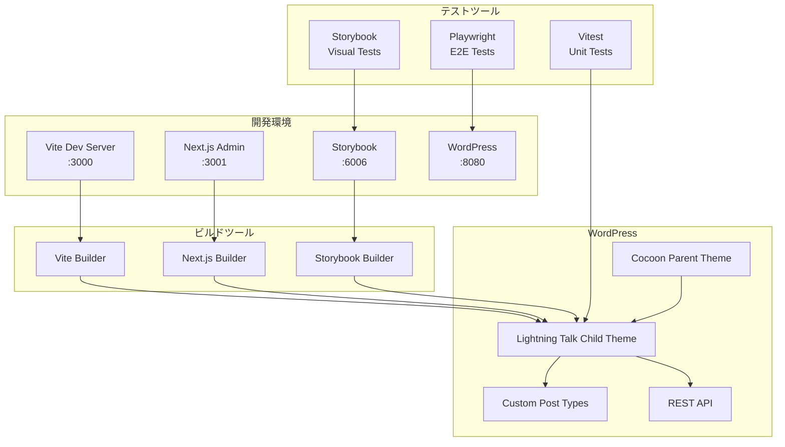

# 🔧 技術スタック統合戦略詳細

**対象**: Lightning Talk WordPress子テーマ  
**統合ツール**: WordPress + Vite + Vitest + Storybook + Next.js + Playwright

---

## 🏗️ アーキテクチャ統合設計

### 全体アーキテクチャ図



## 🔗 技術間統合戦略

### 1. **Vite ↔ WordPress統合**

#### 開発環境統合

```typescript
// vite.config.ts
import { defineConfig } from 'vite';
import { resolve } from 'path';

export default defineConfig({
  // WordPress専用設定
  define: {
    'process.env.WP_HOME': JSON.stringify('http://localhost:8080'),
    'process.env.WP_API_URL': JSON.stringify('http://localhost:8080/wp-json')
  },

  // PHPテンプレート連携
  server: {
    proxy: {
      '^/wp-': 'http://localhost:8080',
      '^/wp-json': 'http://localhost:8080'
    },
    cors: {
      origin: 'http://localhost:8080',
      credentials: true
    }
  },

  // WordPress外部依存
  build: {
    rollupOptions: {
      external: ['jquery', 'wp', 'lodash'],
      output: {
        globals: {
          jquery: 'jQuery',
          wp: 'wp',
          lodash: '_'
        }
      }
    }
  }
});
```

#### PHP側統合コード

```php
<?php
// functions.php - Vite統合関数
class ViteIntegration {
    private $isDev;
    private $manifest;

    public function __construct() {
        $this->isDev = defined('WP_DEBUG') && WP_DEBUG;
        $this->loadManifest();
        add_action('wp_enqueue_scripts', [$this, 'enqueueAssets']);
        add_action('admin_enqueue_scripts', [$this, 'enqueueAdminAssets']);
    }

    public function enqueueAssets() {
        if ($this->isDev) {
            // 開発環境: Vite Dev Server
            wp_enqueue_script('vite-client', 'http://localhost:3000/@vite/client', [], null);
            wp_enqueue_script('theme-main', 'http://localhost:3000/main.ts', ['vite-client'], null);
        } else {
            // 本番環境: ビルド済みアセット
            $mainJs = $this->getAssetUrl('main.ts');
            $mainCss = $this->getAssetUrl('main.css');

            wp_enqueue_script('theme-main', $mainJs, ['jquery'], $this->getVersion());
            wp_enqueue_style('theme-main', $mainCss, [], $this->getVersion());
        }

        // WordPress APIをJSに提供
        wp_localize_script('theme-main', 'wpData', [
            'apiUrl' => home_url('/wp-json/'),
            'nonce' => wp_create_nonce('wp_rest'),
            'currentUser' => wp_get_current_user(),
        ]);
    }

    private function getAssetUrl($entry) {
        if (!$this->manifest || !isset($this->manifest[$entry])) {
            return '';
        }
        return get_template_directory_uri() . '/assets/dist/' . $this->manifest[$entry]['file'];
    }
}

new ViteIntegration();
```

### 2. **Storybook ↔ WordPress統合**

#### WordPress API Mock

```typescript
// .storybook/wordpress-mock.ts
export const createWordPressMocks = () => ({
  wp: {
    api: {
      url: 'http://localhost:6006/mock-api',
      nonce: 'mock-nonce-12345'
    },
    data: {
      currentUser: {
        id: 1,
        name: 'Test User',
        roles: ['administrator']
      }
    }
  },

  // WordPress関数のモック
  __: (text: string) => text, // 翻訳関数
  _n: (single: string, plural: string, number: number) =>
    number === 1 ? single : plural,

  // WordPress AJAX
  ajaxurl: '/mock-ajax'
});
```

#### Storybook設定

```typescript
// .storybook/main.ts
export default {
  framework: '@storybook/react-vite',
  stories: ['../packages/*/src/**/*.stories.@(js|jsx|ts|tsx)'],
  addons: [
    '@storybook/addon-essentials',
    '@storybook/addon-a11y',
    '@storybook/addon-viewport',
    {
      name: '@storybook/addon-docs',
      options: {
        configureJSX: true
      }
    }
  ],
  viteFinal: config => {
    // WordPress環境変数
    config.define = {
      ...config.define,
      'process.env.STORYBOOK': true,
      'process.env.WP_ENV': JSON.stringify('storybook')
    };

    // WordPress外部依存解決
    config.resolve.alias = {
      ...config.resolve.alias,
      '@wordpress/api-fetch': require.resolve('./mocks/wp-api-fetch'),
      '@wordpress/element': require.resolve('react')
    };

    return config;
  }
};
```

### 3. **Next.js ↔ WordPress統合**

#### WordPress API Client

```typescript
// packages/admin-panel/lib/wordpress-client.ts
import { createClient } from '@wordpress/api-fetch';

class WordPressClient {
  private client;

  constructor() {
    this.client = createClient({
      url:
        process.env.NEXT_PUBLIC_WP_API_URL || 'http://localhost:8080/wp-json',
      credentials: 'include'
    });
  }

  // Lightning Talk API ラッパー
  async getEvents() {
    return this.client.get('/lightningtalk/v1/events');
  }

  async createEvent(eventData: EventInput) {
    return this.client.post('/lightningtalk/v1/events', eventData);
  }

  async getParticipants(eventId: string) {
    return this.client.get(`/lightningtalk/v1/events/${eventId}/participants`);
  }

  // WordPress認証
  async authenticate(credentials: LoginCredentials) {
    return this.client.post('/wp-json/jwt-auth/v1/token', credentials);
  }
}

export const wpClient = new WordPressClient();
```

#### Next.js API Routes

```typescript
// pages/api/wp-proxy/[...path].ts
import { NextApiRequest, NextApiResponse } from 'next';
import httpProxy from 'http-proxy-middleware';

export default function handler(req: NextApiRequest, res: NextApiResponse) {
  // WordPress APIへのプロキシ
  const proxy = httpProxy({
    target: process.env.WP_API_URL,
    changeOrigin: true,
    pathRewrite: {
      '^/api/wp-proxy': '/wp-json'
    },
    onProxyReq: (proxyReq, req) => {
      // 認証ヘッダー追加
      if (req.headers.authorization) {
        proxyReq.setHeader('Authorization', req.headers.authorization);
      }
    }
  });

  return proxy(req, res);
}
```

### 4. **Vitest ↔ WordPress統合**

#### WordPress環境テスト

```typescript
// tests/setup/wordpress-test-env.ts
import { beforeAll, afterAll, beforeEach } from 'vitest';
import { execSync } from 'child_process';

// WordPress テスト環境セットアップ
export const setupWordPressTestEnv = () => {
  beforeAll(async () => {
    // WordPress コンテナ起動
    execSync('docker-compose -f docker-compose.test.yml up -d wordpress-test');

    // データベース初期化
    await initializeTestDatabase();

    // テストデータ投入
    await seedTestData();
  });

  afterAll(async () => {
    // テスト環境クリーンアップ
    execSync('docker-compose -f docker-compose.test.yml down');
  });

  beforeEach(async () => {
    // テストデータリセット
    await resetTestData();
  });
};

// WordPress API テストヘルパー
export class WordPressTestClient {
  async createTestEvent(data: Partial<Event>) {
    const response = await fetch(
      'http://localhost:8081/wp-json/lightningtalk/v1/events',
      {
        method: 'POST',
        headers: {
          'Content-Type': 'application/json',
          'X-WP-Nonce': await this.getNonce()
        },
        body: JSON.stringify(data)
      }
    );

    return response.json();
  }

  async getNonce() {
    // テスト用ノンス取得
    const response = await fetch(
      'http://localhost:8081/wp-json/wp/v2/users/me',
      {
        credentials: 'include'
      }
    );
    return response.headers.get('X-WP-Nonce');
  }
}
```

#### 統合テストExample

```typescript
// tests/integration/wordpress-api.test.ts
import { describe, test, expect } from 'vitest';
import {
  setupWordPressTestEnv,
  WordPressTestClient
} from '../setup/wordpress-test-env';

describe('WordPress Lightning Talk API', () => {
  setupWordPressTestEnv();

  const client = new WordPressTestClient();

  test('should create event via REST API', async () => {
    const eventData = {
      title: 'Test Lightning Talk Event',
      date: '2025-07-01T19:00:00Z',
      venue: 'Test Venue',
      capacity: 30
    };

    const event = await client.createTestEvent(eventData);

    expect(event).toBeDefined();
    expect(event.title).toBe(eventData.title);
    expect(event.id).toBeTypeOf('number');
  });

  test('should validate required fields', async () => {
    const invalidData = {
      title: '' // 必須フィールド空
    };

    await expect(client.createTestEvent(invalidData)).rejects.toThrow(
      'Title is required'
    );
  });
});
```

### 5. **Playwright ↔ WordPress統合**

#### WordPress E2Eテスト設定

```typescript
// playwright.config.ts
import { defineConfig, devices } from '@playwright/test';

export default defineConfig({
  // WordPress テスト環境
  use: {
    baseURL: 'http://localhost:8080',
    screenshot: 'only-on-failure',
    video: 'retain-on-failure'
  },

  // テスト環境セットアップ
  globalSetup: require.resolve('./tests/e2e/setup/global-setup.ts'),
  globalTeardown: require.resolve('./tests/e2e/setup/global-teardown.ts'),

  projects: [
    // WordPress フロントエンド
    {
      name: 'wordpress-frontend',
      use: { ...devices['Desktop Chrome'] }
    },

    // WordPress 管理画面
    {
      name: 'wordpress-admin',
      use: {
        ...devices['Desktop Chrome'],
        storageState: './tests/e2e/auth/admin-auth.json'
      }
    },

    // モバイル
    {
      name: 'wordpress-mobile',
      use: { ...devices['iPhone 13'] }
    }
  ]
});
```

#### WordPress認証フィクスチャ

```typescript
// tests/e2e/fixtures/wordpress-auth.ts
import { test as base, expect } from '@playwright/test';

type WordPressFixtures = {
  wpAdmin: WordPressAdminPage;
  wpFrontend: WordPressFrontendPage;
};

export const test = base.extend<WordPressFixtures>({
  wpAdmin: async ({ page }, use) => {
    const admin = new WordPressAdminPage(page);
    await admin.login();
    await use(admin);
    await admin.logout();
  },

  wpFrontend: async ({ page }, use) => {
    const frontend = new WordPressFrontendPage(page);
    await use(frontend);
  }
});

class WordPressAdminPage {
  constructor(private page: Page) {}

  async login() {
    await this.page.goto('/wp-admin');
    await this.page.fill('#user_login', 'admin');
    await this.page.fill('#user_pass', 'password');
    await this.page.click('#wp-submit');

    await expect(this.page.locator('#wpadminbar')).toBeVisible();
  }

  async createEvent(eventData: EventData) {
    await this.page.goto('/wp-admin/post-new.php?post_type=lt_event');
    await this.page.fill('#title', eventData.title);
    await this.page.fill('#content', eventData.description);

    // カスタムフィールド
    await this.page.fill('[name="event_date"]', eventData.date);
    await this.page.fill('[name="venue_name"]', eventData.venue);

    await this.page.click('#publish');
    await expect(this.page.locator('.notice-success')).toBeVisible();
  }
}
```

---

## ⚙️ 設定ファイル統合

### Package.json Workspace設定

```json
{
  "name": "lightningtalk-cocoon-theme",
  "private": true,
  "workspaces": ["packages/*"],
  "scripts": {
    "dev": "concurrently \"npm:dev:*\"",
    "dev:theme": "cd packages/theme && vite",
    "dev:admin": "cd packages/admin-panel && next dev",
    "dev:storybook": "cd packages/components && storybook dev",
    "dev:wordpress": "docker-compose up wordpress",

    "build": "npm run build:components && npm run build:theme && npm run build:admin",
    "build:components": "cd packages/components && storybook build",
    "build:theme": "cd packages/theme && vite build",
    "build:admin": "cd packages/admin-panel && next build",

    "test": "npm run test:unit && npm run test:e2e",
    "test:unit": "vitest",
    "test:e2e": "playwright test",
    "test:visual": "cd packages/components && npm run test:visual",

    "lint": "eslint packages/*/src --ext .ts,.tsx,.js,.jsx",
    "type-check": "tsc --noEmit",

    "wp:reset": "docker-compose down && docker-compose up -d",
    "wp:backup": "docker exec wp-db mysqldump -u root -ppassword wordpress > backup.sql"
  },
  "devDependencies": {
    "@playwright/test": "^1.40.0",
    "@storybook/react-vite": "^7.6.0",
    "@types/wordpress": "^6.0.0",
    "concurrently": "^8.2.0",
    "eslint": "^8.0.0",
    "typescript": "^5.0.0",
    "vite": "^5.0.0",
    "vitest": "^1.0.0"
  }
}
```

### TypeScript共通設定

```json
// tsconfig.json (root)
{
  "compilerOptions": {
    "target": "ES2020",
    "module": "ESNext",
    "moduleResolution": "node",
    "strict": true,
    "esModuleInterop": true,
    "skipLibCheck": true,
    "forceConsistentCasingInFileNames": true,
    "resolveJsonModule": true,
    "isolatedModules": true,
    "noEmit": true,
    "jsx": "preserve",

    // WordPress型定義
    "types": ["wordpress", "node"],

    // パス設定
    "baseUrl": ".",
    "paths": {
      "@/*": ["./packages/*/src/*"],
      "@components/*": ["./packages/components/src/*"],
      "@theme/*": ["./packages/theme/src/*"],
      "@admin/*": ["./packages/admin-panel/*"]
    }
  },
  "references": [
    { "path": "./packages/components" },
    { "path": "./packages/theme" },
    { "path": "./packages/admin-panel" }
  ]
}
```

### Docker Compose統合環境

```yaml
# docker-compose.yml
version: '3.8'

services:
  wordpress:
    image: wordpress:php8.1-apache
    ports:
      - '8080:80'
    environment:
      WORDPRESS_DB_HOST: db
      WORDPRESS_DB_USER: wordpress
      WORDPRESS_DB_PASSWORD: wordpress
      WORDPRESS_DB_NAME: wordpress
      WORDPRESS_DEBUG: 1
    volumes:
      - ./packages/theme:/var/www/html/wp-content/themes/lightningtalk-child
      - ./wordpress-uploads:/var/www/html/wp-content/uploads
    depends_on:
      - db

  db:
    image: mysql:8.0
    environment:
      MYSQL_DATABASE: wordpress
      MYSQL_USER: wordpress
      MYSQL_PASSWORD: wordpress
      MYSQL_ROOT_PASSWORD: rootpassword
    volumes:
      - db_data:/var/lib/mysql

  # 開発ツール用サービス
  node-dev:
    image: node:18-alpine
    working_dir: /app
    volumes:
      - .:/app
    command: npm run dev
    ports:
      - '3000:3000' # Vite
      - '3001:3001' # Next.js
      - '6006:6006' # Storybook

volumes:
  db_data:
```

この技術スタック統合により、モダンな開発体験と高品質なWordPress子テーマの両立が実現できます。
