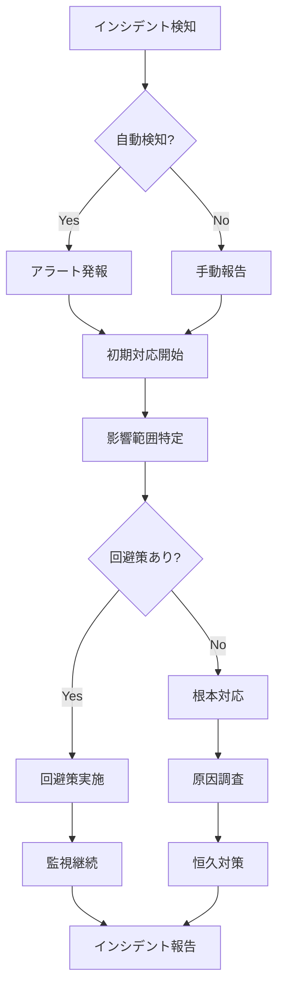

# Lightning Talk Circle - 運用手順書

## 📋 目次

1. [日常運用](#日常運用)
2. [定期メンテナンス](#定期メンテナンス)
3. [トラブルシューティング](#トラブルシューティング)
4. [セキュリティ運用](#セキュリティ運用)
5. [パフォーマンス管理](#パフォーマンス管理)
6. [変更管理](#変更管理)
7. [インシデント対応](#インシデント対応)
8. [災害復旧](#災害復旧)

## 🌅 日常運用

### 朝の確認作業（9:00）

#### 1. システムヘルスチェック

```bash
# ヘルスチェックスクリプト実行
./scripts/daily-health-check.sh

# 手動確認項目
- [ ] CloudWatchダッシュボード確認
- [ ] 夜間アラート有無確認
- [ ] エラーログ確認
- [ ] リソース使用率確認
```

#### 2. 前日メトリクス確認

```bash
# メトリクスレポート生成
aws cloudwatch get-metric-statistics \
  --namespace AWS/ApplicationELB \
  --metric-name RequestCount \
  --start-time $(date -u -d 'yesterday' +%Y-%m-%dT00:00:00) \
  --end-time $(date -u +%Y-%m-%dT00:00:00) \
  --period 86400 \
  --statistics Sum \
  --dimensions Name=LoadBalancer,Value=lightningtalk-prod-alb
```

#### 3. バックアップ確認

```bash
# バックアップ状態確認
aws dynamodb list-backups \
  --table-name lightningtalk-circle-prod-events \
  --time-range-lower-bound $(date -u -d 'yesterday' +%s) \
  --region ap-northeast-1
```

### 営業時間中の監視（9:00-18:00）

#### リアルタイム監視項目

- **応答時間**: 1秒以内（P95）
- **エラー率**: 0.1%以下
- **同時接続数**: 通常時100-500
- **CPU使用率**: 70%以下
- **メモリ使用率**: 80%以下

#### 15分毎のチェック

```bash
# クイックステータスチェック
curl -s https://api.xn--6wym69a.com/health | jq '.'

# アクティブユーザー数確認
aws cloudwatch get-metric-statistics \
  --namespace lightningtalk/Application \
  --metric-name ActiveUsers \
  --start-time $(date -u -d '15 minutes ago' +%Y-%m-%dT%H:%M:%S) \
  --end-time $(date -u +%Y-%m-%dT%H:%M:%S) \
  --period 300 \
  --statistics Average
```

### 夜間バッチ処理（2:00-4:00）

#### 1. データクリーンアップ

```bash
# 古いセッションデータ削除
node scripts/cleanup-sessions.js --days 30

# 期限切れトークン削除
node scripts/cleanup-tokens.js

# ログローテーション
./scripts/rotate-logs.sh
```

#### 2. レポート生成

```bash
# 日次レポート生成
node scripts/generate-daily-report.js

# メトリクス集計
node scripts/aggregate-metrics.js --date yesterday
```

## 🔧 定期メンテナンス

### 週次メンテナンス（毎週日曜日 3:00-5:00）

#### 1. システムアップデート

```bash
# パッケージ更新確認
npm outdated
npm audit

# セキュリティパッチ適用
npm audit fix

# Dockerイメージ更新
docker pull public.ecr.aws/lambda/nodejs:18
```

#### 2. パフォーマンス最適化

```bash
# DynamoDBインデックス最適化
aws dynamodb describe-table --table-name lightningtalk-circle-prod-events
# GSIの使用状況確認と最適化

# CloudFrontキャッシュ統計確認
aws cloudfront get-distribution-config --id $DISTRIBUTION_ID
```

#### 3. ストレージ管理

```bash
# S3ライフサイクル確認
aws s3api get-bucket-lifecycle-configuration \
  --bucket lightningtalk-circle-prod-static

# 不要ファイル削除
aws s3 rm s3://lightningtalk-circle-prod-static/temp/ --recursive
```

### 月次メンテナンス（第1日曜日 2:00-6:00）

#### 1. フルバックアップ

```bash
# 全テーブルのフルバックアップ
./scripts/full-backup.sh

# バックアップ検証
./scripts/verify-backup.sh --type full
```

#### 2. セキュリティ監査

```bash
# セキュリティスキャン実行
./scripts/security-audit.js

# IAMポリシー見直し
aws iam get-account-authorization-details > iam-audit.json
```

#### 3. コスト最適化

```bash
# リソース使用状況分析
aws ce get-cost-and-usage \
  --time-period Start=$(date -d '1 month ago' +%Y-%m-01),End=$(date +%Y-%m-01) \
  --granularity MONTHLY \
  --metrics "UnblendedCost" \
  --group-by Type=DIMENSION,Key=SERVICE
```

## 🚨 トラブルシューティング

### 一般的な問題と対処法

#### 1. API応答遅延

```bash
# 診断手順
1. CloudWatchメトリクス確認
   aws cloudwatch get-metric-data --metric-data-queries file://slow-api-query.json

2. ECSタスク状態確認
   aws ecs describe-tasks --cluster lightningtalk-prod --tasks $(aws ecs list-tasks --cluster lightningtalk-prod --query 'taskArns' --output text)

3. DynamoDB throttling確認
   aws dynamodb describe-table --table-name lightningtalk-circle-prod-events --query 'Table.ProvisionedThroughput'

# 対処法
- ECSタスク数増加
  aws ecs update-service --cluster lightningtalk-prod --service api-service --desired-count 10

- DynamoDBキャパシティ増加（オンデマンドモードの場合は不要）
- キャッシュ有効期限確認
```

#### 2. 503 Service Unavailable

```bash
# 緊急対応
1. ヘルスチェック確認
   for i in {1..5}; do curl -I https://api.xn--6wym69a.com/health; sleep 1; done

2. ALBターゲット確認
   aws elbv2 describe-target-health --target-group-arn $TARGET_GROUP_ARN

3. ECSサービス再起動
   aws ecs update-service --cluster lightningtalk-prod --service api-service --force-new-deployment

# 根本原因調査
- コンテナログ確認
- メモリ/CPU使用率確認
- 依存サービス確認
```

#### 3. データベース接続エラー

```bash
# DynamoDB診断
1. テーブル状態確認
   aws dynamodb describe-table --table-name lightningtalk-circle-prod-events

2. スロットリング確認
   aws cloudwatch get-metric-statistics \
     --namespace AWS/DynamoDB \
     --metric-name ConsumedReadCapacityUnits \
     --dimensions Name=TableName,Value=lightningtalk-circle-prod-events \
     --start-time $(date -u -d '1 hour ago' +%Y-%m-%dT%H:%M:%S) \
     --end-time $(date -u +%Y-%m-%dT%H:%M:%S) \
     --period 300 \
     --statistics Sum

3. エラーログ確認
   aws logs filter-log-events \
     --log-group-name /aws/ecs/lightningtalk-prod \
     --filter-pattern "DynamoDB" \
     --start-time $(date -d '1 hour ago' +%s)000
```

### 緊急時対応手順

#### 完全サービス停止時

```bash
#!/bin/bash
# emergency-recovery.sh

echo "🚨 緊急復旧開始"

# 1. 静的メンテナンスページ表示
aws s3 cp s3://lightningtalk-emergency/maintenance.html s3://lightningtalk-static/index.html
aws cloudfront create-invalidation --distribution-id $CF_DIST_ID --paths "/*"

# 2. 最小構成で再起動
aws ecs update-service --cluster lightningtalk-prod --service api-service --desired-count 2
aws ecs update-service --cluster lightningtalk-prod --service api-service --force-new-deployment

# 3. ヘルスチェック待機
for i in {1..30}; do
  if curl -s https://api.xn--6wym69a.com/health | grep -q "ok"; then
    echo "✅ サービス復旧確認"
    break
  fi
  sleep 10
done

# 4. 段階的スケールアップ
aws ecs update-service --cluster lightningtalk-prod --service api-service --desired-count 5
```

## 🔐 セキュリティ運用

### 日次セキュリティチェック

```bash
# ログイン試行監視
aws logs filter-log-events \
  --log-group-name /aws/ecs/lightningtalk-prod \
  --filter-pattern "Authentication failed" \
  --start-time $(date -d '24 hours ago' +%s)000 | \
  jq '.events | length'

# 異常アクセスパターン検知
./scripts/detect-anomalies.js --period 24h

# WAFブロック状況確認
aws wafv2 get-sampled-requests \
  --web-acl-arn $WAF_ACL_ARN \
  --rule-metric-name BlockedRequests \
  --scope REGIONAL \
  --time-window StartTime=$(date -u -d '1 day ago' +%s),EndTime=$(date +%s) \
  --max-items 100
```

### 週次セキュリティレビュー

```bash
# 1. アクセスキーローテーション確認
aws iam list-access-keys --user-name lightningtalk-service

# 2. セキュリティグループ監査
aws ec2 describe-security-groups --filters Name=group-name,Values=lightningtalk-*

# 3. 証明書有効期限確認
echo | openssl s_client -servername xn--6wym69a.com -connect xn--6wym69a.com:443 2>/dev/null | openssl x509 -noout -dates
```

## 📊 パフォーマンス管理

### パフォーマンスベースライン

| メトリクス       | 通常値 | 警告閾値 | 危険閾値 |
| ---------------- | ------ | -------- | -------- |
| API応答時間(P50) | 50ms   | 200ms    | 500ms    |
| API応答時間(P95) | 200ms  | 500ms    | 1000ms   |
| API応答時間(P99) | 500ms  | 1000ms   | 2000ms   |
| エラー率         | 0.01%  | 0.1%     | 1%       |
| CPU使用率        | 40%    | 70%      | 85%      |
| メモリ使用率     | 50%    | 75%      | 90%      |

### パフォーマンスチューニング

```bash
# 1. 遅いAPIエンドポイント特定
aws logs insights query \
  --log-group-name /aws/ecs/lightningtalk-prod \
  --start-time $(date -d '1 hour ago' +%s) \
  --end-time $(date +%s) \
  --query-string 'fields @timestamp, api_endpoint, duration | filter duration > 1000 | stats avg(duration) by api_endpoint'

# 2. データベースクエリ最適化
node scripts/analyze-db-queries.js --slow-threshold 100

# 3. キャッシュヒット率確認
redis-cli info stats | grep keyspace_hits
```

## 🔄 変更管理

### デプロイメント手順

#### 1. 事前準備

```bash
# チェックリスト
- [ ] 変更内容レビュー完了
- [ ] テスト環境での動作確認
- [ ] ロールバック計画準備
- [ ] 関係者への通知
- [ ] 監視体制確認
```

#### 2. Blue/Greenデプロイメント

```bash
# 新バージョンデプロイ
./scripts/deploy-blue-green.sh --version $NEW_VERSION --environment production

# 動作確認
./scripts/smoke-test.sh --endpoint https://green.xn--6wym69a.com

# トラフィック切り替え
./scripts/switch-traffic.sh --from blue --to green --percentage 10
# 段階的に増加: 10% → 50% → 100%
```

#### 3. デプロイ後確認

```bash
# エラー率監視
watch -n 10 'aws cloudwatch get-metric-statistics \
  --namespace AWS/ApplicationELB \
  --metric-name HTTPCode_Target_5XX_Count \
  --start-time $(date -u -d "5 minutes ago" +%Y-%m-%dT%H:%M:%S) \
  --end-time $(date -u +%Y-%m-%dT%H:%M:%S) \
  --period 60 \
  --statistics Sum'

# パフォーマンス確認
./scripts/performance-test.sh --duration 300
```

### 設定変更管理

```bash
# 環境変数更新
1. Secrets Manager更新
   aws secretsmanager update-secret \
     --secret-id lightningtalk-prod-env \
     --secret-string file://new-env.json

2. ECSタスク定義更新
   aws ecs register-task-definition \
     --cli-input-json file://new-task-definition.json

3. サービス更新
   aws ecs update-service \
     --cluster lightningtalk-prod \
     --service api-service \
     --task-definition lightningtalk-prod-api:$NEW_REVISION
```

## 🚑 インシデント対応

### インシデント分類

| レベル | 定義           | 対応時間 | エスカレーション |
| ------ | -------------- | -------- | ---------------- |
| P1     | サービス全停止 | 即時     | 15分でL3         |
| P2     | 主要機能停止   | 30分     | 1時間でL2        |
| P3     | 部分的障害     | 2時間    | 4時間でL2        |
| P4     | 軽微な問題     | 翌営業日 | 不要             |

### インシデント対応フロー



### インシデント記録テンプレート

```markdown
## インシデント報告 #YYYYMMDD-001

### 概要

- 発生日時: YYYY-MM-DD HH:MM JST
- 検知方法: [自動アラート/ユーザー報告/定期監視]
- 影響範囲: [全体/一部機能/特定ユーザー]
- 重要度: [P1/P2/P3/P4]

### タイムライン

- HH:MM - インシデント検知
- HH:MM - 初期対応開始
- HH:MM - 原因特定
- HH:MM - 回避策実施
- HH:MM - サービス復旧
- HH:MM - 監視終了

### 原因

[根本原因の詳細説明]

### 対応内容

1. [実施した対応1]
2. [実施した対応2]

### 再発防止策

1. [短期対策]
2. [長期対策]

### 教訓

[今回のインシデントから得られた教訓]
```

## 🌊 災害復旧

### DRレベル定義

| レベル | 状況             | RTO   | RPO    | 対応                 |
| ------ | ---------------- | ----- | ------ | -------------------- |
| 1      | サービス一時停止 | 1時間 | 0      | 自動フェイルオーバー |
| 2      | AZ障害           | 2時間 | 1時間  | 手動AZ切り替え       |
| 3      | リージョン障害   | 4時間 | 1時間  | DRサイト起動         |
| 4      | データ破損       | 8時間 | 24時間 | バックアップ復元     |

### DR実行手順

#### レベル3: リージョン障害対応

```bash
#!/bin/bash
# dr-failover.sh

# 1. 現状確認
echo "現在のリージョン状態確認中..."
aws health describe-events --region ap-northeast-1

# 2. DRリージョン起動
echo "DRリージョン(us-west-2)でのスタック起動..."
cd cdk
export CDK_DEPLOY_REGION=us-west-2
npm run cdk:deploy:dr

# 3. データ復元
echo "最新バックアップからのデータ復元..."
./scripts/restore-dynamodb-dr.sh \
  --source-region ap-northeast-1 \
  --target-region us-west-2

# 4. DNS切り替え
echo "Route53 フェイルオーバー実行..."
aws route53 change-resource-record-sets \
  --hosted-zone-id $ZONE_ID \
  --change-batch file://dr-dns-failover.json

# 5. 動作確認
echo "DRサイト動作確認..."
curl -I https://dr.xn--6wym69a.com/health

echo "DR切り替え完了"
```

## 📝 運用チェックリスト

### 日次チェックリスト

- [ ] システムヘルスチェック実行
- [ ] 前日のアラート確認
- [ ] バックアップ成功確認
- [ ] リソース使用率確認
- [ ] セキュリティログレビュー

### 週次チェックリスト

- [ ] パッケージ更新確認
- [ ] パフォーマンストレンド分析
- [ ] コスト使用状況確認
- [ ] ドキュメント更新確認
- [ ] チーム内情報共有

### 月次チェックリスト

- [ ] フルバックアップテスト
- [ ] DR訓練実施
- [ ] セキュリティ監査
- [ ] SLA達成率確認
- [ ] 改善提案まとめ

## 🔗 関連ドキュメント

- [24時間監視体制ガイド](./24H-MONITORING-GUIDE.md)
- [バックアップ計画](./BACKUP-PLAN.md)
- [トラフィック移行計画](./TRAFFIC-MIGRATION-PLAN.md)
- [デプロイメントチェックリスト](./DEPLOYMENT-CHECKLIST.md)
- [セキュリティポリシー](./security/SECURITY-POLICY.md)

---

最終更新: 2025-07-11承認者: 運用チームリード次回レビュー: 2025-08-11
