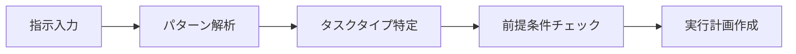
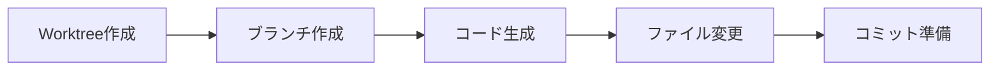
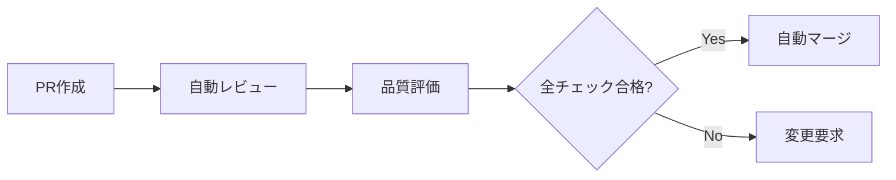

# 自動ワークフローシステム使用ガイド

## 概要

Lightning Talk Circle プロジェクトの自動ワークフローシステムは、自然言語の指示から自動的にworktree作成、開発、テスト、PR作成、レビュー、マージまでを実行する統合システムです。

## 🚀 クイックスタート

### 基本的な使用方法

```bash
# 1. 簡単な指示を実行
npm run workflow execute "add user authentication feature"

# 2. バグ修正
npm run workflow execute "fix login page rendering issue"

# 3. ドキュメント作成
npm run workflow execute "document API endpoints"
```

### インタラクティブモード

```bash
# インタラクティブモードで開始
npm run workflow interactive
```

## 📋 コマンドリファレンス

### 指示実行

```bash
# 基本実行
npm run workflow execute "<instruction>"

# オプション付き実行
npm run workflow execute "add search feature" --auto-merge --parallel

# ドライランモード（実際の変更なし）
npm run workflow execute "refactor database" --dry-run
```

### 指示分析

```bash
# 指示を分析のみ（実行しない）
npm run analyze "implement user dashboard"

# 結果をファイルに出力
npm run analyze "fix performance issue" analysis.json
```

### 品質チェック

```bash
# 品質ゲートを実行
npm run quality

# オプション付きで実行
npm run quality --coverage 85 --parallel --export results.json
```

### ワークフロー管理

```bash
# 現在の状態確認
npm run workflow status

# 実行履歴表示
npm run workflow history

# 特定件数の履歴表示
npm run workflow history --count 20
```

## 🎯 指示の書き方

### 機能開発

```bash
# ✅ 良い例
"add user authentication with OAuth2"
"implement real-time chat feature"
"create admin dashboard"

# ❌ 悪い例
"make it better"
"fix stuff"
"add something"
```

### バグ修正

```bash
# ✅ 良い例
"fix login form validation error"
"resolve memory leak in data processing"
"fix responsive design issues"

# ❌ 悪い例
"fix bug"
"something is broken"
```

### リファクタリング

```bash
# ✅ 良い例
"refactor user service to use async/await"
"optimize database queries for better performance"
"clean up unused dependencies"
```

### ドキュメント

```bash
# ✅ 良い例
"document API authentication flow"
"create user guide for new features"
"add code comments for complex algorithms"
```

## ⚙️ 設定とカスタマイズ

### 環境変数

```bash
# .env ファイルで設定
GITHUB_TOKEN=your_github_token
GITHUB_OWNER=your_username
GITHUB_REPO=repository_name
AUTO_MERGE=true
REQUIRE_REVIEW=true
```

### GitHub Actions 設定

リポジトリの Settings > Variables でワークフロー変数を設定：

- `AUTO_MERGE_ENABLED`: 自動マージの有効/無効
- `REQUIRE_REVIEWS`: 必要なレビュー数
- `REQUIRE_STATUS_CHECKS`: ステータスチェック要求

### 品質ゲート閾値

```bash
# カスタム閾値で品質チェック
npm run quality --coverage 90
```

## 🔄 ワークフローのライフサイクル

### 1. 指示解析フェーズ



### 2. 開発フェーズ



### 3. 品質チェックフェーズ


### 4. レビュー・マージフェーズ



## 📊 品質ゲート詳細

### 実行される品質チェック

1. **ユニットテスト** (25%)
   - 新規・既存テストの実行
   - テスト失敗の検出

2. **統合テスト** (15%)
   - API エンドポイントテスト
   - データベース統合テスト

3. **コードカバレッジ** (15%)
   - ライン・ブランチカバレッジ
   - 閾値: デフォルト80%

4. **コード品質** (15%)
   - ESLint チェック
   - Prettier フォーマット
   - 複雑度分析

5. **セキュリティスキャン** (20%)
   - npm audit
   - ハードコードされた秘密情報検出
   - 脆弱性スキャン

6. **パフォーマンステスト** (5%)
   - レスポンス時間測定
   - メモリ使用量チェック

7. **依存関係チェック** (3%)
   - 古いパッケージ検出
   - セキュリティ更新確認

8. **バンドルサイズ分析** (2%)
   - ファイルサイズ監視
   - 肥大化検出

### スコア計算

- 各ゲートに重み付けスコアを設定
- 全体スコア = Σ(ゲートスコア × 重み) / 総重み
- 80%以上で合格推奨

## 🤖 自動マージ条件

自動マージが実行される条件：

1. ✅ 全品質ゲートが合格
2. ✅ セキュリティスキャンに問題なし
3. ✅ 必要なレビュー数を満たす
4. ✅ ブランチが競合なし
5. ✅ ドラフトPRでない
6. ✅ AUTO_MERGE_ENABLED=true

## 🔧 トラブルシューティング

### よくある問題

1. **テストが失敗する**
   ```bash
   # 手動でテストを実行して確認
   npm test
   
   # 特定のテストのみ実行
   npm run test:unit
   ```

2. **品質ゲートで失敗**
   ```bash
   # 詳細な品質レポートを確認
   npm run quality --export detailed-report.json
   ```

3. **GitHub APIエラー**
   ```bash
   # トークンの確認
   echo $GITHUB_TOKEN
   
   # 権限確認（repo, workflow権限が必要）
   ```

4. **Worktreeエラー**
   ```bash
   # Worktreeクリーンアップ
   npm run worktree clean
   
   # 手動削除
   git worktree prune
   ```

### ログとデバッグ

```bash
# 詳細ログを有効化
DEBUG=lightningtalk:* npm run workflow execute "your instruction"

# 実行履歴確認
npm run workflow history

# 品質ゲート結果確認
cat quality-gate-results.json | jq '.results'
```

## 🔒 セキュリティ考慮事項

### 秘密情報の管理

- GitHub Secrets を使用してトークン管理
- 環境変数でのハードコード禁止
- 自動スキャンによる秘密情報検出

### アクセス制御

- GitHub Token は最小権限の原則
- repo, workflow, actions 権限のみ
- 定期的なトークンローテーション

### コード実行

- 自動生成コードのサンドボックス実行
- 危険なコマンドの実行制限
- コード署名とハッシュ検証

## 📈 パフォーマンス最適化

### 並列実行

```bash
# 品質ゲートを並列実行
npm run quality --parallel

# ワークフロー全体を並列化
npm run workflow execute "instruction" --parallel
```

### キャッシュ活用

- Node.js 依存関係キャッシュ
- Docker イメージキャッシュ
- テスト結果キャッシュ

### リソース最適化

- 軽量Dockerイメージの使用
- 不要なファイルの除外
- 効率的なgitops

## 🎓 ベストプラクティス

### 指示の書き方

1. **具体的に記述**: 「改善」ではなく「パフォーマンス最適化」
2. **範囲を明確に**: 「ユーザー認証機能を追加」
3. **優先度を示す**: 「緊急修正」「hotfix」

### ワークフロー管理

1. **定期的なクリーンアップ**: 古いworktreeの削除
2. **履歴の確認**: 実行パターンの分析
3. **品質維持**: 閾値の定期見直し

### チーム開発

1. **命名規則**: ブランチ名とPRタイトルの統一
2. **レビュープロセス**: 自動レビュー＋人的レビュー
3. **継続的改善**: フィードバックループの確立

## 📞 サポート

### ヘルプコマンド

```bash
# コマンドヘルプ
npm run workflow --help
npm run workflow execute --help
```

### ドキュメント

- [技術仕様書](../technical/technical-specifications.md)
- [API リファレンス](../api/reference.md)
- [トラブルシューティング](../guides/troubleshooting.md)

### コミュニティ

- GitHub Issues でのバグ報告
- Discussions での機能提案
- Wiki での知識共有

---

*このガイドは自動ワークフローシステム v1.0.0 対応版です*