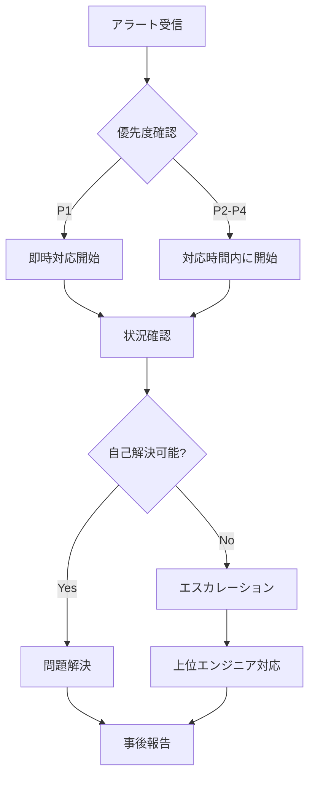

# Lightning Talk Circle - 24時間監視体制ガイド

## 📋 概要

本ドキュメントは、Lightning Talk
Circleシステムの24時間監視体制を確立し、サービスの安定稼働を保証するための包括的なガイドラインです。

## 🎯 監視目標

- **可用性**: 99.9%以上（月間ダウンタイム43分以内）
- **応答時間**: 初期対応15分以内
- **問題解決**: 重大インシデント4時間以内
- **予防的検知**: 問題の80%を事前検知

## 👥 監視体制

### シフト構成

```
日本時間（JST）基準：
- 早番: 06:00 - 14:00（8時間）
- 遅番: 14:00 - 22:00（8時間）
- 夜勤: 22:00 - 06:00（8時間）

週末・祝日：
- オンコール体制（2名）
- プライマリ/セカンダリ担当制
```

### 役割と責任

#### L1 監視オペレーター

- アラート初期対応
- 基本的なトラブルシューティング
- エスカレーション判断
- 監視ダッシュボード常時確認

#### L2 システムエンジニア

- 技術的問題の解決
- システム復旧作業
- 根本原因分析
- 手順書の更新

#### L3 シニアエンジニア/アーキテクト

- 重大インシデント対応
- アーキテクチャレベルの判断
- 緊急時の最終決定権

## 🖥️ 監視ダッシュボード

### プライマリダッシュボード

#### 1. システムヘルスダッシュボード

```
URL: https://cloudwatch.ap-northeast-1.amazonaws.com/dashboard/lightningtalk-health

主要メトリクス:
- API応答時間（P50, P95, P99）
- エラー率（4xx, 5xx）
- アクティブユーザー数
- システムリソース使用率
```

#### 2. インフラストラクチャダッシュボード

```
URL: https://cloudwatch.ap-northeast-1.amazonaws.com/dashboard/lightningtalk-infra

監視項目:
- ECSタスク状態
- ALBヘルスチェック
- DynamoDBスロットリング
- S3アクセスパターン
```

#### 3. ビジネスメトリクスダッシュボード

```
URL: https://cloudwatch.ap-northeast-1.amazonaws.com/dashboard/lightningtalk-business

KPI:
- イベント作成数
- 参加登録数
- トーク投稿数
- ユーザーアクティビティ
```

### カスタムダッシュボード設定

```javascript
// CloudWatch Dashboard JSON
{
  "widgets": [
    {
      "type": "metric",
      "properties": {
        "metrics": [
          ["AWS/ECS", "CPUUtilization", {"stat": "Average"}],
          ["...", {"stat": "Maximum"}]
        ],
        "period": 300,
        "stat": "Average",
        "region": "ap-northeast-1",
        "title": "ECS CPU使用率"
      }
    },
    {
      "type": "log",
      "properties": {
        "query": "SOURCE '/aws/ecs/lightningtalk-circle'\n| fields @timestamp, @message\n| filter @message like /ERROR/\n| sort @timestamp desc\n| limit 20",
        "region": "ap-northeast-1",
        "title": "最新エラーログ"
      }
    }
  ]
}
```

## 🚨 アラート設定

### 優先度レベル

#### P1 - Critical（即時対応）

```yaml
条件:
  - サービス完全停止
  - データ損失の可能性
  - セキュリティ侵害

通知:
  - PagerDuty: 即時
  - Slack: #critical-alerts
  - 電話: オンコール担当者

対応時間: 15分以内
```

#### P2 - High（1時間以内対応）

```yaml
条件:
  - 部分的機能停止
  - パフォーマンス重大劣化
  - エラー率5%超過

通知:
  - PagerDuty: 5分遅延
  - Slack: #high-alerts
  - Email: チーム全体

対応時間: 1時間以内
```

#### P3 - Medium（4時間以内対応）

```yaml
条件:
  - パフォーマンス軽微劣化
  - 非重要機能の不具合
  - リソース使用率警告

通知:
  - Slack: #medium-alerts
  - Email: 担当チーム

対応時間: 4時間以内
```

#### P4 - Low（翌営業日対応）

```yaml
条件:
  - 改善提案
  - 非緊急の不具合
  - 定期メンテナンス

通知:
  - Slack: #low-alerts
  - チケット作成

対応時間: 翌営業日
```

### アラートルール設定例

```bash
# CPU使用率アラート
aws cloudwatch put-metric-alarm \
  --alarm-name "lightningtalk-high-cpu-p2" \
  --alarm-description "ECS CPU使用率が80%を超過" \
  --metric-name CPUUtilization \
  --namespace AWS/ECS \
  --statistic Average \
  --period 300 \
  --threshold 80 \
  --comparison-operator GreaterThanThreshold \
  --evaluation-periods 2 \
  --alarm-actions arn:aws:sns:ap-northeast-1:123456789012:high-priority-alerts

# エラー率アラート
aws cloudwatch put-metric-alarm \
  --alarm-name "lightningtalk-error-rate-p1" \
  --alarm-description "5xxエラー率が1%を超過" \
  --metric-name HTTPCode_Target_5XX_Count \
  --namespace AWS/ApplicationELB \
  --statistic Sum \
  --period 60 \
  --threshold 10 \
  --comparison-operator GreaterThanThreshold \
  --evaluation-periods 3 \
  --alarm-actions arn:aws:sns:ap-northeast-1:123456789012:critical-alerts
```

## 📱 オンコール手順

### オンコールキット

```
必須ツール:
- ノートPC（VPN設定済み）
- スマートフォン（PagerDutyアプリ）
- 2FAデバイス
- 緊急連絡先リスト
- ランブック（オフライン版）
```

### 初期対応フロー



### エスカレーションマトリックス

| 時間帯   | P1 Critical    | P2 High       | P3 Medium | P4 Low   |
| -------- | -------------- | ------------- | --------- | -------- |
| 平日日中 | L1→L2（15分）  | L1→L2（30分） | L1対応    | チケット |
| 平日夜間 | L1→L2→L3       | L1→L2         | 翌朝対応  | チケット |
| 週末祝日 | オンコール即時 | オンコール    | 翌営業日  | チケット |

## 🔍 トラブルシューティング

### 一般的な問題と対処法

#### 1. API応答遅延

```bash
# 診断コマンド
aws ecs describe-services --cluster lightningtalk-prod --services api-service
aws logs tail /aws/ecs/lightningtalk-prod --follow --since 5m

# 対処法
1. ECSタスク数の確認と増加
2. DynamoDBスロットリングの確認
3. 外部API依存の確認
```

#### 2. 503エラー多発

```bash
# 診断
curl -I https://api.xn--6wym69a.com/health
aws elbv2 describe-target-health --target-group-arn $TG_ARN

# 対処法
1. ターゲットグループのヘルスチェック
2. ECSタスクの再起動
3. ALBのアクセスログ確認
```

#### 3. データベース接続エラー

```bash
# 診断
aws dynamodb describe-table --table-name lightningtalk-prod-events
aws cloudwatch get-metric-statistics \
  --namespace AWS/DynamoDB \
  --metric-name ConsumedReadCapacityUnits \
  --dimensions Name=TableName,Value=lightningtalk-prod-events \
  --start-time $(date -u -d '1 hour ago' +%Y-%m-%dT%H:%M:%S) \
  --end-time $(date -u +%Y-%m-%dT%H:%M:%S) \
  --period 300 \
  --statistics Average

# 対処法
1. オンデマンドモードへの切り替え検討
2. GSIの使用状況確認
3. アプリケーションの再試行ロジック確認
```

### 緊急対応スクリプト

```bash
#!/bin/bash
# emergency-response.sh

case "$1" in
  restart-all)
    echo "Restarting all services..."
    aws ecs update-service --cluster lightningtalk-prod --service api-service --force-new-deployment
    aws ecs update-service --cluster lightningtalk-prod --service websocket-service --force-new-deployment
    ;;

  scale-up)
    echo "Scaling up services..."
    aws ecs update-service --cluster lightningtalk-prod --service api-service --desired-count 10
    ;;

  enable-maintenance)
    echo "Enabling maintenance mode..."
    aws s3 cp maintenance.html s3://lightningtalk-static/index.html
    aws cloudfront create-invalidation --distribution-id $CF_DIST_ID --paths "/*"
    ;;

  rollback)
    echo "Rolling back to previous version..."
    ./scripts/rollback-deployment.sh
    ;;
esac
```

## 📊 レポーティング

### 日次レポート

```
提出時間: 毎朝9:00
内容:
- 過去24時間のインシデント
- システム稼働率
- 主要メトリクスサマリー
- 改善提案
```

### 週次レポート

```
提出時間: 毎週月曜10:00
内容:
- 週間インシデント分析
- パフォーマンストレンド
- リソース使用状況
- 予防保守提案
```

### 月次レポート

```
提出時間: 月初第3営業日
内容:
- SLA達成状況
- インシデント根本原因分析
- 改善施策の効果測定
- 次月の重点監視項目
```

## 🛠️ ツールとリソース

### 監視ツール

- **CloudWatch**: メトリクス、ログ、アラート
- **X-Ray**: 分散トレーシング
- **Grafana**: カスタムダッシュボード
- **PagerDuty**: インシデント管理
- **Slack**: チームコミュニケーション

### 必須ブックマーク

```
AWS Console: https://console.aws.amazon.com/
CloudWatch: https://ap-northeast-1.console.aws.amazon.com/cloudwatch/
ECS Console: https://ap-northeast-1.console.aws.amazon.com/ecs/
DynamoDB: https://ap-northeast-1.console.aws.amazon.com/dynamodb/
Runbook: https://wiki.internal/lightningtalk/runbook
```

### 緊急連絡先

```yaml
インシデントコマンダー:
  主: incident-commander@example.com / 090-XXXX-XXXX
  副: deputy-commander@example.com / 090-YYYY-YYYY

AWSサポート:
  Business: https://console.aws.amazon.com/support/
  緊急: +1-206-266-4064

インフラチーム:
  Slack: #infra-emergency
  Email: infra-team@example.com
```

## 📚 トレーニングと改善

### 新人オンボーディング

1. 監視ツールアクセス設定（1日目）
2. ダッシュボード操作研修（2日目）
3. アラート対応シミュレーション（3日目）
4. シャドーイング期間（1週間）
5. 独立オンコール開始（2週間後）

### 定期訓練

- 月次: 障害対応シミュレーション
- 四半期: 大規模障害訓練
- 年次: BCPテスト

### 継続的改善

- インシデント事後分析（必須）
- 自動化機会の特定
- 監視精度の向上
- ランブックの更新

## ✅ チェックリスト

### シフト開始時

- [ ] 前シフトからの引き継ぎ確認
- [ ] ダッシュボード正常性確認
- [ ] 未解決アラートの確認
- [ ] 予定メンテナンスの確認
- [ ] 緊急連絡先の確認

### シフト中

- [ ] 15分毎のダッシュボード確認
- [ ] アラート対応記録
- [ ] エスカレーション判断
- [ ] コミュニケーション維持

### シフト終了時

- [ ] 引き継ぎ事項の文書化
- [ ] 未解決問題の申し送り
- [ ] 監視ログの記録
- [ ] 改善提案の記載

---

最終更新: 2025-07-11承認者: 運用チームリード次回レビュー: 2025-08-11
