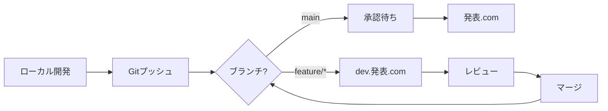

# 開発フローガイド

## 概要

Lightning Talk
Circleでは、以下の環境を使用した段階的な開発フローを採用しています：

1. **ローカル環境** - 開発者のマシンでの開発
2. **dev.発表.com** - 開発環境（AWS）
3. **発表.com** - 本番環境（AWS）

## 環境の詳細

### ローカル環境

- **URL**: http://localhost:3000
- **用途**: 機能開発、デバッグ、単体テスト
- **データベース**: ファイルベースまたはDocker PostgreSQL
- **特徴**: ホットリロード、デバッグツール有効

### 開発環境（dev.発表.com）

- **URL**: https://dev.xn--6wym69a.com
- **用途**: 統合テスト、レビュー、デモ
- **データベース**: DynamoDB（開発用テーブル）
- **特徴**: 本番に近い環境、自動デプロイ

### 本番環境（発表.com）

- **URL**: https://xn--6wym69a.com
- **用途**: エンドユーザー向けサービス
- **データベース**: DynamoDB（本番用テーブル）
- **特徴**: 高可用性、監視、バックアップ

## 開発ワークフロー

### 1. 初期セットアップ

```bash
# リポジトリのクローン
git clone https://github.com/20m61/lightningtalk-circle.git
cd lightningtalk-circle

# 依存関係のインストール
npm install

# ローカル環境の設定
npm run env:local

# ローカル開発サーバーの起動
npm run dev
```

### 2. 新機能の開発

```bash
# 最新のmainブランチを取得
git checkout main
git pull origin main

# フィーチャーブランチの作成
git checkout -b feature/your-feature-name

# ローカルで開発
npm run dev

# テストの実行
npm test

# コードの品質チェック
npm run lint
npm run format:check
```

### 3. 開発環境へのデプロイ

```bash
# 変更をコミット
git add .
git commit -m "feat: 新機能の説明"

# リモートにプッシュ（自動的にdev.発表.comにデプロイ）
git push origin feature/your-feature-name
```

GitHub Actionsが自動的に以下を実行：

- テストの実行
- ビルド
- dev.発表.comへのデプロイ

### 4. Pull Requestの作成

```bash
# GitHub CLIを使用
gh pr create \
  --title "feat: 新機能の実装" \
  --body "## 概要\n新機能の説明\n\n## 変更内容\n- 変更点1\n- 変更点2\n\n## テスト\n- [x] ローカルでテスト完了\n- [x] dev環境でテスト完了"

# またはWebブラウザで作成
```

### 5. コードレビュー

- レビュアーがdev.発表.comで動作確認
- コードレビューの実施
- 必要に応じて修正

### 6. マージと本番デプロイ

```bash
# PRがマージされた後、mainブランチを更新
git checkout main
git pull origin main

# 本番へのデプロイ（手動承認が必要）
npm run deploy:production
```

## 環境管理コマンド

### 環境の切り替え

```bash
# ローカル環境に切り替え
npm run env:local

# 開発環境設定に切り替え
npm run env:dev

# 本番環境設定に切り替え
npm run env:prod

# 現在の環境を確認
./scripts/environment-manager.sh status
```

### デプロイメント

```bash
# dev.発表.comへのデプロイ
npm run deploy:dev

# 発表.comへのデプロイ（承認必要）
npm run deploy:production
```

## ブランチ戦略

```
main
  ├── develop（オプション）
  └── feature/feature-name
      └── bugfix/bug-name
```

- **main**: 本番環境に対応
- **feature/**: 新機能開発
- **bugfix/**: バグ修正
- **hotfix/**: 緊急修正

## 自動化されたワークフロー

### プッシュ時の自動処理

1. **feature/** ブランチへのプッシュ
   - テスト実行
   - dev.発表.comへ自動デプロイ

2. **mainブランチへのマージ**
   - テスト実行
   - 本番ビルド
   - 手動承認後、発表.comへデプロイ

### デプロイメントパイプライン



## トラブルシューティング

### よくある問題

1. **環境変数エラー**

   ```bash
   # 環境設定を確認
   ./scripts/environment-manager.sh validate
   ```

2. **デプロイ失敗**

   ```bash
   # ログを確認
   aws logs tail /aws/lambda/lightningtalk-circle-dev --follow
   ```

3. **ローカル環境の問題**
   ```bash
   # クリーンインストール
   rm -rf node_modules
   npm install
   ```

## ベストプラクティス

### コミットメッセージ

```
feat: 新機能の追加
fix: バグの修正
docs: ドキュメントの更新
style: コードスタイルの変更
refactor: リファクタリング
test: テストの追加・修正
chore: ビルドプロセスやツールの変更
```

### テスト

- ローカルでユニットテストを実行
- dev環境で統合テストを実施
- 本番デプロイ前にE2Eテストを確認

### セキュリティ

- シークレットは環境変数で管理
- 本番環境の認証情報は絶対にコミットしない
- AWS Secrets Managerを使用

## リソース

- [マルチ環境ワークフロー](./MULTI-ENVIRONMENT-WORKFLOW.md)
- [環境設定ガイド](./ENVIRONMENT-GUIDE.md)
- [CDKデプロイメントガイド](../cdk/README.md)
