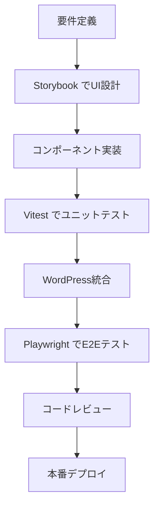

# 🚀 モダン開発環境でのWordPress Cocoon子テーマ構築計画

**策定日**: 2025-06-21  
**対象**: Lightning Talk Circle WordPress子テーマ  
**技術スタック**: WordPress + Vite + Vitest + Storybook + Next.js + Playwright

---

## 🎯 プロジェクト目標

### 主要目的
1. **モダンな開発体験**: 高速ビルド、HMR、TypeScript対応
2. **高品質なコード**: 包括的テスト、型安全性、コンポーネント駆動開発
3. **効率的なワークフロー**: 自動化されたCI/CD、デザインシステム統合
4. **WordPress最適化**: Cocoonテーマとの完全互換性、パフォーマンス最適化

### 成果物
- **WordPress子テーマ**: Lightning Talk管理機能付きCocoon子テーマ
- **管理画面**: React/Next.js製の高機能管理パネル
- **デザインシステム**: Storybookベースのコンポーネントライブラリ
- **テストスイート**: E2E・Unit・Integration完全カバレージ

---

## 🛠️ 技術スタック詳細分析

### 1. **Vite** - ビルドツール
**役割**: 高速開発サーバー、モジュールバンドリング
```json
{
  "利点": [
    "ES Module ベースの超高速HMR",
    "TypeScript/JSX ゼロコンフィグ対応", 
    "Tree Shaking最適化",
    "WordPress向けプラグイン豊富"
  ],
  "用途": [
    "PHP/JS/CSS のビルド",
    "開発サーバー起動",
    "本番用アセット最適化"
  ]
}
```

### 2. **Vitest** - テストフレームワーク
**役割**: 高速Unit/Integration テスト
```json
{
  "利点": [
    "Viteネイティブ統合",
    "Jest互換API",
    "ESM完全サポート",
    "高速実行・監視モード"
  ],
  "用途": [
    "JavaScript/TypeScript ユニットテスト",
    "WordPress API統合テスト",
    "コンポーネントテスト"
  ]
}
```

### 3. **Storybook** - コンポーネント開発
**役割**: 独立コンポーネント開発・ドキュメント化
```json
{
  "利点": [
    "コンポーネント駆動開発",
    "デザインシステム構築", 
    "ビジュアルテスト",
    "WordPress環境から独立"
  ],
  "用途": [
    "UIコンポーネント開発",
    "デザイナー・開発者協業",
    "ビジュアルリグレッションテスト"
  ]
}
```

### 4. **Next.js** - 管理画面フレームワーク
**役割**: 高機能WordPress管理画面構築
```json
{
  "利点": [
    "SSR/SSG対応",
    "TypeScript完全統合",
    "APIルート機能",
    "最適化されたパフォーマンス"
  ],
  "用途": [
    "WordPress管理画面拡張",
    "Lightning Talk管理パネル",
    "レポート・ダッシュボード"
  ]
}
```

### 5. **Playwright** - E2Eテスト
**役割**: 包括的ブラウザテスト自動化
```json
{
  "利点": [
    "マルチブラウザ対応",
    "真のE2Eテスト",
    "視覚的テスト対応",
    "WordPress特化機能"
  ],
  "用途": [
    "WordPress全機能テスト",
    "フロントエンド動作確認",
    "Cocoon統合テスト"
  ]
}
```

---

## 🏗️ プロジェクト構造設計

### 推奨ディレクトリ構成
```
lightningtalk-cocoon-theme/
├── 📦 packages/                    # Monorepo構成
│   ├── theme/                      # WordPress子テーマ
│   │   ├── functions.php
│   │   ├── style.css
│   │   ├── assets/
│   │   │   ├── src/
│   │   │   │   ├── js/
│   │   │   │   ├── css/
│   │   │   │   └── components/
│   │   │   └── dist/               # Viteビルド出力
│   │   ├── templates/
│   │   ├── includes/
│   │   └── languages/
│   ├── admin-panel/                # Next.js管理画面
│   │   ├── pages/
│   │   ├── components/
│   │   ├── lib/
│   │   ├── styles/
│   │   └── public/
│   ├── components/                 # 共有UIコンポーネント
│   │   ├── src/
│   │   ├── stories/
│   │   └── dist/
│   └── api/                        # WordPress REST API拡張
├── 🧪 tests/                       # テストスイート
│   ├── unit/                       # Vitest
│   ├── integration/                # Vitest + WordPress
│   ├── e2e/                        # Playwright
│   └── visual/                     # Storybook VRT
├── 🔧 tools/                       # 開発ツール
│   ├── vite.config.js
│   ├── vitest.config.js
│   ├── .storybook/
│   ├── playwright.config.js
│   └── scripts/
├── 📚 docs/                        # ドキュメント
├── 🐳 docker/                      # 開発環境
└── 📋 package.json                 # Workspace設定
```

### Monorepo管理
```json
{
  "workspaces": [
    "packages/*"
  ],
  "scripts": {
    "dev": "concurrently \"npm run dev:theme\" \"npm run dev:admin\" \"npm run dev:storybook\"",
    "dev:theme": "cd packages/theme && vite",
    "dev:admin": "cd packages/admin-panel && next dev",
    "dev:storybook": "cd packages/components && storybook dev",
    "build": "npm run build:theme && npm run build:admin && npm run build:storybook",
    "test": "npm run test:unit && npm run test:e2e",
    "test:unit": "vitest",
    "test:e2e": "playwright test"
  }
}
```

---

## 🔄 開発ワークフロー設計

### 1. **開発環境起動フロー**
```bash
# 1. 全環境同時起動
npm run dev

# 並行実行内容:
# - Vite Dev Server (localhost:3000) - テーマアセット
# - Next.js (localhost:3001) - 管理画面
# - Storybook (localhost:6006) - コンポーネント
# - WordPress (localhost:8080) - メインサイト
```

### 2. **機能開発フロー**


### 3. **コンポーネント駆動開発**
```typescript
// 1. Storybookでコンポーネント設計
export default {
  title: 'LightningTalk/EventCard',
  component: EventCard,
} as ComponentMeta<typeof EventCard>;

// 2. TypeScript実装
interface EventCardProps {
  title: string;
  date: Date;
  venue: string;
  participants: number;
}

// 3. WordPress統合
function registerEventCardShortcode() {
  add_shortcode('lt_event_card', function($atts) {
    // React コンポーネントをサーバーサイドレンダリング
  });
}
```

---

## 🧪 テスト戦略

### 1. **Unit テスト (Vitest)**
```typescript
// JavaScript/TypeScript ロジックテスト
describe('EventManager', () => {
  test('should create event with validation', () => {
    const event = new EventManager();
    expect(event.create(validData)).toBeTruthy();
    expect(event.create(invalidData)).toThrow();
  });
});

// WordPress API テスト
describe('WordPress Integration', () => {
  test('should register custom post type', async () => {
    await setupWordPressTest();
    expect(postTypeExists('lt_event')).toBe(true);
  });
});
```

### 2. **E2E テスト (Playwright)**
```typescript
// WordPress全機能テスト
test('Lightning Talk registration flow', async ({ page }) => {
  // 1. イベントページアクセス
  await page.goto('/events/sample-event');
  
  // 2. 参加登録フォーム
  await page.fill('[data-testid="participant-name"]', 'テストユーザー');
  await page.fill('[data-testid="participant-email"]', 'test@example.com');
  
  // 3. 送信・確認
  await page.click('[data-testid="submit-button"]');
  await expect(page.locator('.success-message')).toBeVisible();
  
  // 4. 管理画面確認
  await page.goto('/wp-admin');
  await expect(page.locator('.participant-list')).toContainText('テストユーザー');
});
```

### 3. **Visual テスト (Storybook)**
```typescript
// ビジュアルリグレッションテスト
import { expect } from '@storybook/jest';

export const Default = () => <EventCard {...defaultProps} />;

Default.play = async ({ canvasElement }) => {
  // スクリーンショット比較
  await expect(canvasElement).toMatchSnapshot();
};
```

---

## ⚙️ 設定ファイル設計

### 1. **Vite設定 (vite.config.js)**
```typescript
import { defineConfig } from 'vite';
import { resolve } from 'path';

export default defineConfig({
  root: 'packages/theme/assets/src',
  build: {
    outDir: '../dist',
    rollupOptions: {
      input: {
        main: resolve(__dirname, 'packages/theme/assets/src/main.js'),
        admin: resolve(__dirname, 'packages/theme/assets/src/admin.js'),
      },
    },
  },
  server: {
    proxy: {
      // WordPress開発サーバーへプロキシ
      '/wp-': 'http://localhost:8080',
    },
  },
  plugins: [
    // WordPress特化プラグイン
    wordpressExternals(),
    phpIntegration(),
  ],
});
```

### 2. **WordPress統合設定**
```php
<?php
// functions.php - Viteアセット統合
function enqueue_vite_assets() {
    if (defined('WP_DEBUG') && WP_DEBUG) {
        // 開発環境: Vite Dev Server
        wp_enqueue_script('vite-client', 'http://localhost:3000/@vite/client', [], null);
        wp_enqueue_script('theme-main', 'http://localhost:3000/main.js', [], null);
    } else {
        // 本番環境: ビルド済みアセット
        $manifest = json_decode(file_get_contents(get_template_directory() . '/assets/dist/manifest.json'), true);
        wp_enqueue_script('theme-main', get_template_directory_uri() . '/assets/dist/' . $manifest['main.js']['file']);
    }
}
add_action('wp_enqueue_scripts', 'enqueue_vite_assets');
```

---

## 🚀 CI/CD パイプライン

### GitHub Actions ワークフロー
```yaml
name: WordPress Theme CI/CD

on: [push, pull_request]

jobs:
  test:
    runs-on: ubuntu-latest
    steps:
      - uses: actions/checkout@v3
      - uses: actions/setup-node@v3
        with:
          node-version: '18'
          cache: 'npm'
      
      # 依存関係インストール
      - run: npm ci
      
      # Unit テスト
      - run: npm run test:unit
      
      # WordPress環境セットアップ
      - run: docker-compose up -d wordpress
      
      # E2E テスト
      - run: npm run test:e2e
      
      # ビルド
      - run: npm run build
      
      # WordPress テーマパッケージ作成
      - run: npm run package:theme

  deploy:
    needs: test
    if: github.ref == 'refs/heads/main'
    runs-on: ubuntu-latest
    steps:
      # 本番環境デプロイ
      - run: npm run deploy:production
```

---

## 📋 実装フェーズ計画

### Phase 1: 基盤構築 (1-2週間)
- [ ] Monorepo セットアップ
- [ ] Vite + TypeScript 環境構築
- [ ] Storybook 初期設定
- [ ] WordPress開発環境 (Docker)
- [ ] 基本CI/CD パイプライン

### Phase 2: コアコンポーネント (2-3週間)
- [ ] Lightning Talk コンポーネントライブラリ
- [ ] WordPress REST API 拡張
- [ ] 基本Cocoon子テーマ実装
- [ ] Vitest ユニットテスト

### Phase 3: 管理機能 (2-3週間)
- [ ] Next.js 管理画面
- [ ] 参加者・イベント管理機能
- [ ] ダッシュボード・レポート機能
- [ ] 権限管理・セキュリティ

### Phase 4: テスト・最適化 (1-2週間)
- [ ] Playwright E2E テスト完全実装
- [ ] パフォーマンス最適化
- [ ] アクセシビリティ対応
- [ ] 本番環境デプロイ

### Phase 5: 運用・保守 (継続)
- [ ] 監視・ログ機能
- [ ] 自動更新システム
- [ ] ドキュメント整備
- [ ] ユーザーサポート

---

## 🎯 期待される効果

### 開発効率
- **高速開発**: Vite HMR で即座の変更反映
- **型安全性**: TypeScript による早期エラー検出
- **コンポーネント駆動**: 再利用可能なUIライブラリ

### 品質向上
- **包括的テスト**: Unit + Integration + E2E
- **自動化**: CI/CD による品質ゲート
- **ビジュアルテスト**: デザイン一貫性保証

### 運用・保守
- **モニタリング**: パフォーマンス・エラー監視
- **自動デプロイ**: ゼロダウンタイム更新
- **ドキュメント**: Storybook ベース設計文書

---

## 🔄 次のアクション

### 即座に開始
1. **技術選定確認**: ステークホルダー承認
2. **開発環境準備**: Docker + WordPress セットアップ
3. **リポジトリ構造**: Monorepo 構成実装

### 準備期間
1. **チーム編成**: 開発・デザイン・QA役割分担
2. **要件詳細化**: Lightning Talk機能仕様策定
3. **デザインシステム**: Figma + Storybook 連携

---

**📅 策定日**: 2025-06-21  
**👨‍💻 策定者**: Claude Code  
**🔄 承認待ち**: プロジェクトステークホルダー