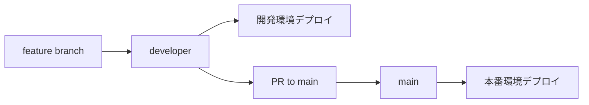

# Lightning Talk Circle - 開発ワークフローガイド

## ブランチ戦略

### ブランチ構成

```
main (本番)
├── developer (開発統合)
│   ├── feature/新機能-A
│   ├── feature/新機能-B
│   ├── fix/バグ修正-A
│   └── hotfix/緊急修正
```

### ブランチ役割

#### 🏗️ **main ブランチ**

- **目的**: 本番環境に対応した安定版
- **保護**: Direct push禁止、PR必須
- **デプロイ**: AWS本番環境への自動デプロイ
- **品質**: 全テスト通過、コードレビュー完了が必須

#### 🚀 **developer ブランチ**

- **目的**: 開発作業の統合ブランチ
- **用途**: フィーチャーブランチの統合先
- **テスト**: CI/CDによる継続的テスト
- **デプロイ**: AWS開発環境への自動デプロイ

#### 🎯 **フィーチャーブランチ**

- **命名規則**: `feature/機能名-説明`
- **作成元**: `developer` ブランチから作成
- **マージ先**: `developer` ブランチへPR

## 開発フロー

### 1. 新機能開発

```bash
# 1. developerブランチから最新を取得
git checkout developer
git pull origin developer

# 2. フィーチャーブランチ作成
git checkout -b feature/screenshot-enhancement

# 3. 開発作業
# ... コード変更 ...

# 4. コミット
git add .
git commit -m "feat: Add screenshot thumbnail preview"

# 5. プッシュ
git push -u origin feature/screenshot-enhancement

# 6. PR作成 (developer ← feature)
gh pr create --base developer --title "feat: Screenshot Enhancement" --body "..."
```

### 2. バグ修正

```bash
# バグ修正も同様の流れ
git checkout -b fix/screenshot-upload-error
# ... 修正作業 ...
git commit -m "fix: Resolve screenshot upload timeout issue"
```

### 3. 緊急修正 (Hotfix)

```bash
# 本番で緊急対応が必要な場合
git checkout main
git pull origin main
git checkout -b hotfix/critical-security-fix

# ... 修正 ...
git commit -m "hotfix: Fix critical security vulnerability"

# main と developer 両方にマージ
gh pr create --base main --title "hotfix: Critical Security Fix"
gh pr create --base developer --title "hotfix: Critical Security Fix"
```

## PR (Pull Request) ワークフロー

### PR作成時のチェックリスト

- [ ] **ブランチ**: `developer` ← `feature/xxx`
- [ ] **タイトル**: 適切なprefixと説明 (`feat:`, `fix:`, `docs:`, etc.)
- [ ] **説明**: 変更内容、テスト手順、影響範囲
- [ ] **テスト**: 新規テスト追加、既存テスト通過
- [ ] **ドキュメント**: 必要に応じて更新

### PR作成テンプレート

```markdown
## 概要

<!-- 何を変更したかを簡潔に -->

## 変更内容

- [ ] 新機能追加
- [ ] バグ修正
- [ ] パフォーマンス改善
- [ ] リファクタリング
- [ ] ドキュメント更新

## テスト

- [ ] ユニットテスト追加/更新
- [ ] 手動テスト完了
- [ ] E2Eテスト確認

## 確認事項

- [ ] ESLint/Prettier通過
- [ ] TypeScript型チェック通過
- [ ] セキュリティスキャン通過
- [ ] パフォーマンステスト

## 影響範囲

<!-- どの部分に影響するか -->

## 破壊的変更

<!-- Breaking changes があれば記載 -->
```

## 品質ゲート

### 自動チェック (CI/CD)

```yaml
品質ゲート:
  - コードフォーマット (Prettier)
  - 構文チェック (ESLint)
  - 型チェック (TypeScript)
  - ユニットテスト (Jest)
  - 統合テスト
  - E2Eテスト (Playwright)
  - セキュリティスキャン (npm audit)
  - パフォーマンステスト
```

### 手動レビュー

- **コードレビュー**: 最低1名のapproval必須
- **設計レビュー**: 大きな変更時は設計議論
- **セキュリティレビュー**: 認証、権限関連の変更

## デプロイメント

### 自動デプロイ



### 環境別設定

| 環境 | ブランチ  | URL                  | 用途                   |
| ---- | --------- | -------------------- | ---------------------- |
| 開発 | developer | https://dev.発表.com | 機能テスト、統合テスト |
| 本番 | main      | https://発表.com     | エンドユーザー向け     |

## コミットメッセージ規約

### Conventional Commits

```
<type>(<scope>): <description>

[optional body]

[optional footer(s)]
```

### Type一覧

- **feat**: 新機能
- **fix**: バグ修正
- **docs**: ドキュメント
- **style**: コードスタイル (フォーマット等)
- **refactor**: リファクタリング
- **perf**: パフォーマンス改善
- **test**: テスト追加/修正
- **chore**: ビルド、設定ファイル等

### 例

```bash
feat(screenshots): Add drag and drop upload
fix(auth): Resolve token refresh issue
docs(api): Update endpoint documentation
test(utils): Add unit tests for helper functions
```

## ローカル開発環境

### 必須ツール

```bash
# Node.js & npm
node --version  # v18+
npm --version   # v9+

# Git設定
git config user.name "Your Name"
git config user.email "you@example.com"

# 開発ツール
npm install -g @lightning/cli  # プロジェクト専用CLI
```

### 開発サーバー起動

```bash
# 基本開発サーバー
npm run dev

# サンプルデータ付き
npm run dev:seed

# ホットリロード + テスト監視
npm run dev:watch
```

### テスト実行

```bash
# 全テスト
npm test

# 単体テスト
npm run test:unit

# 監視モード
npm run test:watch

# カバレッジ
npm run test:coverage
```

## トラブルシューティング

### よくある問題

1. **ブランチが古い**

   ```bash
   git checkout developer
   git pull origin developer
   git checkout feature/your-branch
   git rebase developer
   ```

2. **マージコンフリクト**

   ```bash
   git status
   # 競合ファイルを手動修正
   git add .
   git rebase --continue
   ```

3. **テスト失敗**

   ```bash
   # テスト詳細確認
   npm test -- --verbose

   # 特定テスト実行
   npm test -- tests/unit/specific.test.js
   ```

4. **Pre-commit hooks失敗**

   ```bash
   # フォーマット修正
   npm run format:fix

   # リント修正
   npm run lint:fix
   ```

## チーム連携

### コミュニケーション

- **日次**: 進捗共有、ブロッカー相談
- **週次**: 技術レビュー、アーキテクチャ議論
- **リリース前**: QAテスト、デプロイ確認

### ドキュメント更新

- **CHANGELOG.md**: リリース毎の変更履歴
- **README.md**: セットアップ手順
- **docs/**: 詳細仕様、アーキテクチャ
- **API docs**: OpenAPIスキーマ

この開発ワークフローにより、品質の高いソフトウェアを効率的に開発できます。
