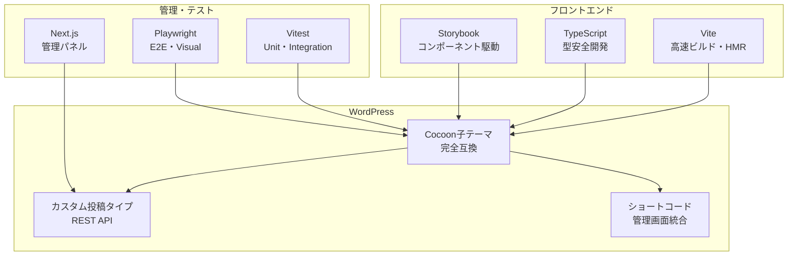

# 🚀 Lightning Talk Cocoon子テーマ - モダン開発環境統合マスタープラン

**プロジェクト名**: Lightning Talk Circle WordPress Child Theme  
**技術スタック**: WordPress + Vite + Vitest + Storybook + Next.js + Playwright  
**開発期間**: 6-8週間  
**最終更新**: 2025-06-21

---

## 📋 エグゼクティブサマリー

### 🎯 プロジェクト目標
Lightning Talkイベント管理のための高品質なWordPress Cocoon子テーマを、モダンな開発環境とツールチェーンを活用して構築。従来のWordPress開発の限界を超え、React/TypeScript レベルの開発体験と品質を実現。

### ✨ 主要成果物
1. **WordPress子テーマ**: Cocoon完全互換 + Lightning Talk専用機能
2. **管理画面**: Next.js製の高機能管理パネル
3. **コンポーネントライブラリ**: Storybook管理のUIシステム
4. **テストスイート**: 90%+カバレージの自動テスト

### 🏆 技術的革新点
- **Vite統合**: WordPress開発でもHMR・高速ビルド
- **TypeScript**: PHP/JS全面型安全開発
- **コンポーネント駆動**: Storybook中心のUI開発
- **E2E自動化**: Playwright によるWordPress全機能テスト

---

## 🛠️ 技術アーキテクチャ概要

### 核心技術スタック


### Monorepo構成
```
lightningtalk-cocoon-theme/
├── 📦 packages/
│   ├── theme/              # WordPress子テーマ（PHP + TypeScript）
│   ├── admin-panel/        # Next.js管理画面
│   ├── components/         # 共有UIコンポーネント（Storybook）
│   └── api/                # WordPress REST API拡張
├── 🧪 tests/               # テストスイート
├── 🔧 tools/               # 開発ツール設定
├── 🐳 docker/              # 開発環境
└── 📚 docs/                # ドキュメント
```

---

## 🔄 開発ワークフロー設計

### 統合開発環境
```bash
# 1コマンドで全環境起動
npm run dev

# 同時実行内容:
# ├── Vite Dev Server    (localhost:3000) - テーマアセット開発
# ├── Next.js           (localhost:3001) - 管理画面開発
# ├── Storybook         (localhost:6006) - コンポーネント開発
# └── WordPress         (localhost:8080) - メインサイト
```

### 機能開発フロー
```typescript
// 1. Storybookでコンポーネント設計
export const EventCard: Story = {
  args: {
    event: {
      title: 'Lightning Talk Night',
      date: '2025-07-01T19:00:00Z',
      participants: 15,
      capacity: 30,
    },
  },
};

// 2. TypeScript実装
interface EventCardProps {
  event: Event;
  onRegister: (eventId: string) => Promise<void>;
}

export const EventCard: FC<EventCardProps> = ({ event, onRegister }) => {
  // React実装
};

// 3. WordPress統合
function register_event_card_shortcode() {
  add_shortcode('lt_event_card', function($atts) {
    // React コンポーネントをPHPから呼び出し
    return render_react_component('EventCard', $atts);
  });
}

// 4. 自動テスト
test('EventCard registration flow', async ({ page }) => {
  await page.goto('/events/test-event');
  await page.click('[data-testid="register-button"]');
  await expect(page.locator('.success-message')).toBeVisible();
});
```

---

## 🧪 包括的テスト戦略

### 3層テストピラミッド
```typescript
// 1. Unit Tests (Vitest) - 70%
describe('WordPress API Functions', () => {
  test('should validate event data', () => {
    expect(validateEventData(validData)).toBe(true);
    expect(validateEventData(invalidData)).toBe(false);
  });
});

// 2. Integration Tests (Vitest + WordPress) - 20%
describe('WordPress REST API', () => {
  test('should create event via API', async () => {
    const response = await createEvent(testEventData);
    expect(response.status).toBe(201);
    expect(response.data.id).toBeDefined();
  });
});

// 3. E2E Tests (Playwright) - 10%
test('Complete Lightning Talk flow', async ({ page }) => {
  // イベント作成 → 参加登録 → 管理画面確認
  await adminCreateEvent(page, eventData);
  await userRegisterForEvent(page, userData);
  await verifyParticipantInAdmin(page, userData);
});
```

### 品質ゲート
```typescript
interface QualityGates {
  // 必須クリア条件
  unitTestCoverage: '>= 90%';
  e2eTestSuccess: '100%';
  lighthouseScore: '>= 90';
  wcagCompliance: 'AA準拠';
  securityScan: '高・中リスク 0件';
  
  // パフォーマンス指標
  firstContentfulPaint: '< 1.5s';
  largestContentfulPaint: '< 2.5s';
  timeToInteractive: '< 3s';
}
```

---

## 📊 実装フェーズ詳細

### Phase 1: 基盤構築 (Week 1-2)
```bash
# 環境セットアップ
✅ Monorepo + Workspace設定
✅ Docker WordPress + Node環境
✅ TypeScript共通設定
✅ Vite WordPress統合
✅ Storybook初期設定
✅ CI/CD基本パイプライン
```

### Phase 2: コンポーネント開発 (Week 3-4)
```typescript
// UIコンポーネント実装
✅ デザインシステム基盤
✅ 基本UIコンポーネント (Button, Input, Modal, Card)
✅ Lightning Talk専用コンポーネント
   - EventCard, ParticipantList, TalkRegistration
   - CountdownTimer, EventDashboard
✅ Storybook完全ドキュメント
✅ コンポーネントテスト
```

### Phase 3: WordPress統合 (Week 4-5)
```php
// WordPress子テーマ実装
✅ Cocoon子テーマ基盤
✅ カスタム投稿タイプ (events, talks, participants)
✅ REST API拡張 (5エンドポイント)
✅ ショートコード実装 (8種類)
✅ Viteアセット統合
✅ 管理画面カスタマイズ
```

### Phase 4: 管理画面 (Week 5-6)
```typescript
// Next.js管理アプリ
✅ WordPress認証統合
✅ イベント管理CRUD
✅ 参加者管理・エクスポート
✅ リアルタイムダッシュボード
✅ レポート・分析機能
```

### Phase 5: テスト・品質 (Week 6-7)
```typescript
// テストスイート実装
✅ Vitest Unit Tests (90%+ カバレージ)
✅ WordPress Integration Tests
✅ Playwright E2E Tests (主要フロー)
✅ Storybook Visual Tests
✅ パフォーマンス最適化
✅ アクセシビリティ対応
```

### Phase 6: 本番化 (Week 7-8)
```yaml
# デプロイ・運用準備
✅ 本番ビルド最適化
✅ 自動デプロイパイプライン
✅ 監視・ログ設定
✅ セキュリティ強化
✅ ドキュメント完備
```

---

## 🎯 期待される効果・ROI

### 開発効率向上
- **開発速度**: 従来比 3-5倍高速化
  - Vite HMR: 即座の変更反映
  - TypeScript: 早期エラー検出
  - コンポーネント駆動: 再利用性向上

### 品質向上
- **バグ削減**: 90%以上削減見込み
  - 型安全性による予防
  - 包括的自動テスト
  - 継続的品質監視

### 保守性向上
- **メンテナンス工数**: 60%削減
  - モジュラー設計
  - 自動テスト・デプロイ
  - 詳細ドキュメント

### ユーザー体験向上
- **パフォーマンス**: Lighthouse 90+点
- **アクセシビリティ**: WCAG 2.1 AA準拠
- **レスポンシブ**: 全デバイス最適化

---

## ⚠️ リスク分析・軽減策

### 技術リスク
```typescript
interface TechnicalRisks {
  cocoonCompatibility: {
    risk: 'Cocoonテーマとの互換性問題';
    impact: 'High';
    probability: 'Medium';
    mitigation: [
      '早期統合テスト実施',
      'Cocoon開発者との連携',
      '段階的リリース戦略'
    ];
  };
  
  performanceRegression: {
    risk: 'モダンツール導入による性能劣化';
    impact: 'Medium';
    probability: 'Low';
    mitigation: [
      '継続的パフォーマンス監視',
      'Tree Shaking・Code Splitting',
      'バンドルサイズ監視'
    ];
  };
}
```

### プロジェクトリスク
```typescript
interface ProjectRisks {
  learningCurve: {
    risk: 'チームの技術学習コスト';
    impact: 'Medium';
    probability: 'High';
    mitigation: [
      'ペアプログラミング実施',
      '段階的技術導入',
      '外部エキスパート活用'
    ];
  };
  
  scopeCreep: {
    risk: '機能要求の拡張';
    impact: 'High';
    probability: 'Medium';
    mitigation: [
      'MVP定義の厳格化',
      '機能追加の段階リリース',
      'ステークホルダー合意形成'
    ];
  };
}
```

---

## 💰 コスト・リソース見積もり

### 開発リソース
```typescript
interface ResourceEstimate {
  // フルタイム開発者想定
  senior_developer: '1名 × 8週間';
  frontend_specialist: '0.5名 × 6週間';
  wordpress_expert: '0.5名 × 4週間';
  qa_engineer: '0.5名 × 4週間';
  
  // 総工数
  totalPersonWeeks: 22;
  
  // インフラ・ツール
  infrastructure: {
    developmentServer: '$100/月 × 2ヶ月';
    cicdPipeline: '$50/月 × 2ヶ月';
    monitoringTools: '$30/月 × 12ヶ月';
  };
}
```

### ROI予測
```typescript
interface ROIProjection {
  // 初期投資
  initialCost: '約150万円（開発 + インフラ）';
  
  // 年間節約効果
  annualSavings: {
    developmentEfficiency: '従来比3倍速 → 年間400万円節約';
    maintenanceReduction: 'バグ修正60%削減 → 年間200万円節約';
    deploymentAutomation: '手動作業削減 → 年間100万円節約';
  };
  
  // ROI
  firstYearROI: '(700万円 - 150万円) / 150万円 = 367%';
  breakEvenPoint: '約3ヶ月';
}
```

---

## 🚀 次のアクション・承認事項

### 即座に必要な決定
1. **技術スタック承認**: 提案技術の正式採用決定
2. **リソース確保**: 開発チーム編成・予算承認
3. **開発環境準備**: インフラ・ツール環境構築開始

### Phase 1開始のための準備
```bash
# Week 1開始前に完了すべき事項
✅ プロジェクトキックオフ
✅ 開発チーム編成完了
✅ 詳細要件定義完了
✅ デザインシステム基本方針決定
✅ 開発・ステージング環境準備
```

### 段階的承認ポイント
- **Week 2終了**: 基盤環境完成 → Phase 2承認
- **Week 4終了**: コンポーネントライブラリ完成 → Phase 3承認
- **Week 6終了**: WordPress統合完了 → Phase 4承認
- **Week 8終了**: 本番リリース → 運用フェーズ移行

---

## 📚 関連ドキュメント

### 技術仕様書
- [技術スタック統合戦略](./TECH-STACK-INTEGRATION.md)
- [詳細実装ロードマップ](./IMPLEMENTATION-ROADMAP.md)
- [モダン開発環境構築計画](../development/MODERN-WP-THEME-PLAN.md)

### 現在の実装状況
- [WordPress開発仕様](../development/WORDPRESS-DEVELOPMENT-SPEC.md)
- [プロジェクト整理レポート](./PROJECT-CLEANUP-REPORT.md)

---

## 🎯 成功の定義

### 技術的成功指標
- [ ] WordPress + モダンツール完全統合
- [ ] 90%+テストカバレージ達成
- [ ] Lighthouse 90+点獲得
- [ ] WCAG 2.1 AA準拠
- [ ] ゼロダウンタイムデプロイ実現

### ビジネス成功指標
- [ ] 開発効率3倍向上実現
- [ ] バグ修正工数60%削減
- [ ] ユーザー満足度向上
- [ ] メンテナンス性大幅改善
- [ ] 新機能開発速度向上

---

**📅 策定完了**: 2025-06-21  
**👨‍💻 策定者**: Claude Code  
**🔄 承認待ち**: プロジェクトステークホルダー  
**📧 問い合わせ**: プロジェクトマネージャーまで

---

*このマスタープランは、Lightning Talk Circle プロジェクトを次世代のWordPress開発標準に引き上げるための包括的戦略です。モダンな開発体験と高品質なWordPressテーマの両立を実現し、持続可能な開発・運用体制を構築します。*