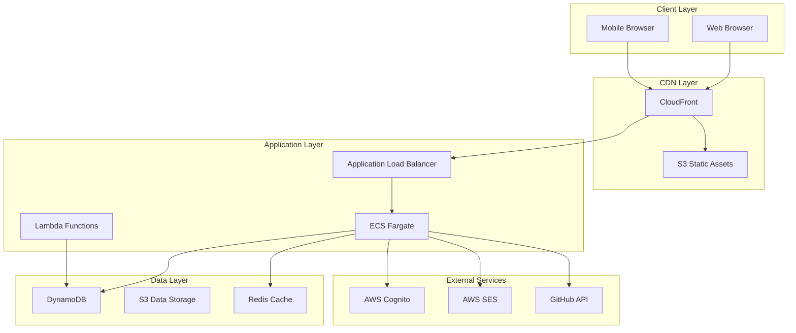

# Lightning Talk Circle 技術仕様書

## 目次

1. [システム概要](#システム概要)
2. [アーキテクチャ](#アーキテクチャ)
3. [技術スタック](#技術スタック)
4. [データモデル](#データモデル)
5. [API仕様](#api仕様)
6. [セキュリティ](#セキュリティ)
7. [パフォーマンス](#パフォーマンス)
8. [スケーラビリティ](#スケーラビリティ)
9. [監視とロギング](#監視とロギング)
10. [デプロイメント](#デプロイメント)

## システム概要

Lightning Talk Circleは、ライトニングトークイベントの管理を包括的にサポートするWebアプリケーションです。

### 主要コンポーネント



## アーキテクチャ

### マルチティアアーキテクチャ

#### 1. プレゼンテーション層
- **静的アセット**: CloudFront + S3
- **動的コンテンツ**: Server-Side Rendering (SSR)
- **リアルタイム通信**: WebSocket (Socket.io)

#### 2. アプリケーション層
- **API サーバー**: Node.js + Express.js
- **認証**: AWS Cognito + JWT
- **バックグラウンド処理**: AWS Lambda

#### 3. データ層
- **プライマリDB**: DynamoDB
- **キャッシュ**: Redis
- **ファイルストレージ**: S3

### デプロイメントモード

1. **静的サイト**: S3 + CloudFront
2. **サーバーレス**: API Gateway + Lambda
3. **コンテナ**: ECS Fargate
4. **WordPress**: PHP + MySQL

## 技術スタック

### フロントエンド

| 技術 | バージョン | 用途 |
|------|-----------|------|
| HTML5 | - | マークアップ |
| CSS3 | - | スタイリング |
| JavaScript | ES6+ | インタラクティブ機能 |
| Socket.io | 4.x | リアルタイム通信 |
| Google Maps API | v3 | 地図表示 |
| DOMPurify | 3.x | XSS対策 |

### バックエンド

| 技術 | バージョン | 用途 |
|------|-----------|------|
| Node.js | 18.x LTS | ランタイム |
| Express.js | 4.x | Webフレームワーク |
| AWS SDK | 3.x | AWSサービス連携 |
| jsonwebtoken | 9.x | JWT処理 |
| bcrypt | 5.x | パスワードハッシュ |
| express-validator | 7.x | 入力検証 |
| helmet | 7.x | セキュリティヘッダー |

### インフラストラクチャ

| 技術 | 用途 |
|------|------|
| AWS CDK | Infrastructure as Code |
| Docker | コンテナ化 |
| GitHub Actions | CI/CD |
| CloudWatch | 監視・ロギング |

## データモデル

### DynamoDB テーブル設計

#### Events テーブル
```json
{
  "TableName": "Events",
  "PartitionKey": "eventId",
  "SortKey": "SK",
  "GlobalSecondaryIndexes": [
    {
      "IndexName": "StatusDateIndex",
      "PartitionKey": "status",
      "SortKey": "date"
    }
  ],
  "Attributes": {
    "eventId": "String",
    "SK": "String",
    "title": "String",
    "date": "String (ISO 8601)",
    "location": "String",
    "description": "String",
    "capacity": "Number",
    "status": "String (upcoming|active|past)",
    "createdAt": "String (ISO 8601)",
    "updatedAt": "String (ISO 8601)"
  }
}
```

#### Participants テーブル
```json
{
  "TableName": "Participants",
  "PartitionKey": "eventId",
  "SortKey": "userId",
  "GlobalSecondaryIndexes": [
    {
      "IndexName": "UserEventsIndex",
      "PartitionKey": "userId",
      "SortKey": "eventId"
    }
  ],
  "Attributes": {
    "eventId": "String",
    "userId": "String",
    "attendanceType": "String (in-person|online)",
    "registeredAt": "String (ISO 8601)",
    "dietaryRestrictions": "String",
    "emergencyContact": "Map",
    "status": "String (registered|cancelled)"
  }
}
```

#### Talks テーブル
```json
{
  "TableName": "Talks",
  "PartitionKey": "talkId",
  "SortKey": "SK",
  "GlobalSecondaryIndexes": [
    {
      "IndexName": "EventTalksIndex",
      "PartitionKey": "eventId",
      "SortKey": "order"
    }
  ],
  "Attributes": {
    "talkId": "String",
    "SK": "String",
    "eventId": "String",
    "speakerId": "String",
    "title": "String",
    "description": "String",
    "duration": "Number",
    "order": "Number",
    "status": "String (submitted|approved|rejected)",
    "equipment": "StringSet"
  }
}
```

### データアクセスパターン

1. **イベント一覧取得**
   - Index: StatusDateIndex
   - Query: status = 'upcoming' AND date > now()

2. **ユーザーの参加イベント**
   - Index: UserEventsIndex
   - Query: userId = :userId

3. **イベントのトーク一覧**
   - Index: EventTalksIndex
   - Query: eventId = :eventId

## API仕様

### RESTful API設計原則

- リソースベースのURL設計
- HTTPメソッドの適切な使用
- ステートレスな通信
- 一貫性のあるレスポンス形式

### エンドポイント構成

```
/api
├── /auth
│   ├── POST   /register
│   ├── POST   /login
│   ├── POST   /logout
│   ├── POST   /refresh
│   └── POST   /google
├── /events
│   ├── GET    /
│   ├── POST   /
│   ├── GET    /:id
│   ├── PUT    /:id
│   ├── DELETE /:id
│   └── GET    /:id/participants
├── /participants
│   ├── POST   /events/:eventId/register
│   └── DELETE /events/:eventId/cancel
├── /talks
│   ├── POST   /events/:eventId/submit
│   ├── GET    /:id
│   ├── PUT    /:id
│   └── DELETE /:id
└── /admin
    ├── GET    /dashboard
    ├── GET    /users
    └── GET    /analytics
```

### レスポンス形式

#### 成功レスポンス
```json
{
  "success": true,
  "data": {
    // レスポンスデータ
  },
  "meta": {
    "timestamp": "2025-07-25T10:00:00Z",
    "version": "1.0.0"
  }
}
```

#### エラーレスポンス
```json
{
  "success": false,
  "error": {
    "code": "VALIDATION_ERROR",
    "message": "入力値が無効です",
    "details": {
      "field": "email",
      "reason": "無効なメールアドレス形式"
    }
  }
}
```

## セキュリティ

### 認証・認可

#### AWS Cognito統合
```javascript
// Cognito設定
const cognitoConfig = {
  UserPoolId: process.env.COGNITO_USER_POOL_ID,
  ClientId: process.env.COGNITO_CLIENT_ID,
  Region: process.env.AWS_REGION
};

// JWT検証ミドルウェア
const verifyToken = async (req, res, next) => {
  const token = req.headers.authorization?.split(' ')[1];
  
  try {
    const decoded = await cognitoVerifier.verify(token);
    req.user = decoded;
    next();
  } catch (error) {
    res.status(401).json({ error: 'Unauthorized' });
  }
};
```

### セキュリティヘッダー

```javascript
// Helmet.js設定
app.use(helmet({
  contentSecurityPolicy: {
    directives: {
      defaultSrc: ["'self'"],
      styleSrc: ["'self'", "'unsafe-inline'"],
      scriptSrc: ["'self'", "https://maps.googleapis.com"],
      imgSrc: ["'self'", "data:", "https:"],
      connectSrc: ["'self'", "wss:", "https:"]
    }
  },
  hsts: {
    maxAge: 31536000,
    includeSubDomains: true,
    preload: true
  }
}));
```

### 入力検証

```javascript
// express-validator使用例
const validateEvent = [
  body('title').trim().isLength({ min: 3, max: 100 }).escape(),
  body('date').isISO8601().toDate(),
  body('location').trim().isLength({ min: 3, max: 200 }),
  body('capacity').isInt({ min: 1, max: 1000 }),
  handleValidationErrors
];
```

### レート制限

```javascript
const rateLimiter = rateLimit({
  windowMs: 15 * 60 * 1000, // 15分
  max: 100, // 最大100リクエスト
  message: 'リクエスト数が制限を超えました',
  standardHeaders: true,
  legacyHeaders: false
});

// 登録エンドポイント用の厳格な制限
const registrationLimiter = rateLimit({
  windowMs: 60 * 60 * 1000, // 1時間
  max: 5, // 最大5リクエスト
  skipSuccessfulRequests: false
});
```

## パフォーマンス

### 最適化戦略

#### 1. キャッシング
```javascript
// Redis キャッシング
const cacheMiddleware = (duration = 300) => {
  return async (req, res, next) => {
    const key = `cache:${req.originalUrl}`;
    const cached = await redis.get(key);
    
    if (cached) {
      return res.json(JSON.parse(cached));
    }
    
    res.sendResponse = res.json;
    res.json = (body) => {
      redis.setex(key, duration, JSON.stringify(body));
      res.sendResponse(body);
    };
    
    next();
  };
};
```

#### 2. データベース最適化
- 適切なインデックス設計
- バッチ処理の活用
- 並列クエリの実行

#### 3. アセット最適化
- 画像の遅延読み込み
- CSS/JSの圧縮・結合
- CDN配信

### パフォーマンス目標

| メトリクス | 目標値 |
|-----------|--------|
| ページロード時間 | < 3秒 |
| API レスポンス時間 | < 200ms |
| Time to First Byte | < 600ms |
| First Contentful Paint | < 1.8秒 |

## スケーラビリティ

### 水平スケーリング

#### ECS オートスケーリング
```yaml
AutoScalingTarget:
  MinCapacity: 2
  MaxCapacity: 10
  TargetCPUUtilization: 70
  TargetMemoryUtilization: 80
```

#### DynamoDB オートスケーリング
```yaml
ReadCapacity:
  Min: 5
  Max: 500
  TargetUtilization: 70
WriteCapacity:
  Min: 5
  Max: 500
  TargetUtilization: 70
```

### 負荷分散

- Application Load Balancer による負荷分散
- 複数AZへの分散配置
- ヘルスチェックによる自動フェイルオーバー

## 監視とロギング

### CloudWatch統合

#### カスタムメトリクス
```javascript
// メトリクス送信
await cloudWatch.putMetricData({
  Namespace: 'LightningTalkCircle',
  MetricData: [
    {
      MetricName: 'EventRegistrations',
      Value: 1,
      Unit: 'Count',
      Dimensions: [
        { Name: 'EventId', Value: eventId }
      ]
    }
  ]
}).promise();
```

#### アラーム設定
- CPU使用率 > 80%
- メモリ使用率 > 85%
- エラーレート > 1%
- レスポンス時間 > 1000ms

### ログ管理

```javascript
// 構造化ログ
const logger = winston.createLogger({
  format: winston.format.combine(
    winston.format.timestamp(),
    winston.format.json()
  ),
  transports: [
    new winston.transports.CloudWatch({
      logGroupName: '/aws/ecs/lightningtalk',
      logStreamName: `${process.env.ENVIRONMENT}-${Date.now()}`
    })
  ]
});
```

## デプロイメント

### CI/CDパイプライン

```yaml
stages:
  - test
  - build
  - deploy

test:
  script:
    - npm test
    - npm run test:integration
    - npm run test:e2e

build:
  script:
    - npm run build:all
    - docker build -t lightningtalk:$CI_COMMIT_SHA .
    - docker push $ECR_REPOSITORY:$CI_COMMIT_SHA

deploy:
  script:
    - npm run cdk:deploy:$ENVIRONMENT
```

### Blue/Greenデプロイメント

1. 新バージョンを新しいターゲットグループにデプロイ
2. ヘルスチェックの確認
3. トラフィックを段階的に切り替え
4. 問題があれば即座にロールバック

### ロールバック戦略

```bash
# 前バージョンへのロールバック
aws ecs update-service \
  --cluster lightningtalk-cluster \
  --service lightningtalk-service \
  --task-definition lightningtalk:PREVIOUS_VERSION
```

## 災害復旧

### バックアップ戦略

- DynamoDB: ポイントインタイムリカバリ有効
- S3: バージョニング有効
- 設定ファイル: AWS Secrets Manager で管理

### RTO/RPO目標

- RTO (Recovery Time Objective): 1時間
- RPO (Recovery Point Objective): 15分

## まとめ

この技術仕様書は、Lightning Talk Circleシステムの技術的な詳細を包括的に記述しています。継続的な更新と改善により、システムの信頼性、パフォーマンス、セキュリティを維持・向上させていきます。